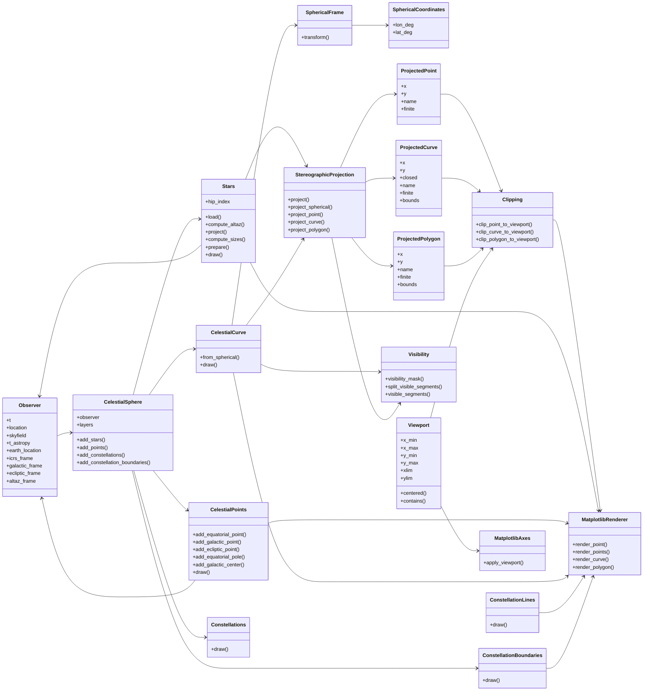
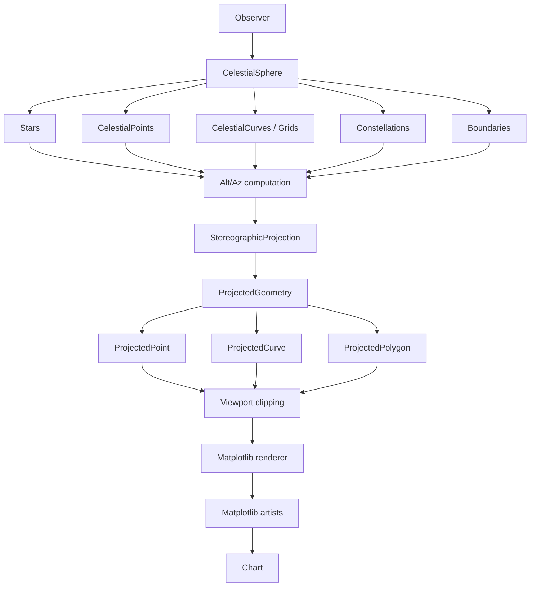

# Wenu Current Architecture

```mermaid
classDiagram
    direction LR

    class Observer {
        +t
        +location
        +skyfield
        +t_astropy
        +earth_location
        +icrs_frame
        +galactic_frame
        +ecliptic_frame
        +altaz_frame
    }

    class CelestialSphere {
        +observer
        +add_stars()
        +add_points()
        +add_constellations()
        +add_constellation_boundaries()
        +layers
    }

    class Stars {
        +load()
        +compute_altaz()
        +project()
        +compute_sizes()
        +prepare()
        +draw()
        +hip_index
    }

    class CelestialPoints {
        +add_equatorial_point()
        +add_galactic_point()
        +add_ecliptic_point()
        +add_equatorial_pole()
        +add_galactic_center()
        +draw()
    }

    class CelestialCurve {
        +from_spherical()
        +draw()
    }

    class Constellations {
        +draw()
    }

    class ConstellationLines {
        +draw()
    }

    class ConstellationBoundaries {
        +draw()
    }

    class SphericalFrame {
        +transform()
    }

    class SphericalCoordinates {
        +lon_deg
        +lat_deg
    }

    class StereographicProjection {
        +project()
        +project_spherical()
        +project_point()
        +project_curve()
        +project_polygon()
    }

    class ProjectedPoint {
        +x
        +y
        +name
        +finite
    }

    class ProjectedCurve {
        +x
        +y
        +closed
        +name
        +finite
        +bounds
    }

    class ProjectedPolygon {
        +x
        +y
        +name
        +finite
        +bounds
    }

    class Viewport {
        +x_min
        +x_max
        +y_min
        +y_max
        +centered()
        +contains()
        +xlim
        +ylim
    }

    class Clipping {
        +clip_point_to_viewport()
        +clip_curve_to_viewport()
        +clip_polygon_to_viewport()
    }

    class Visibility {
        +visibility_mask()
        +split_visible_segments()
        +visible_segments()
    }

    class MatplotlibRenderer {
        +render_point()
        +render_points()
        +render_curve()
        +render_polygon()
    }

    class MatplotlibAxes {
        +apply_viewport()
    }

    Observer --> CelestialSphere
    CelestialSphere --> Stars
    CelestialSphere --> CelestialPoints
    CelestialSphere --> Constellations
    CelestialSphere --> ConstellationBoundaries
    CelestialSphere --> CelestialCurve

    Stars --> Observer
    CelestialPoints --> Observer
    CelestialCurve --> SphericalFrame
    SphericalFrame --> SphericalCoordinates

    Stars --> StereographicProjection
    CelestialCurve --> StereographicProjection
    StereographicProjection --> ProjectedPoint
    StereographicProjection --> ProjectedCurve
    StereographicProjection --> ProjectedPolygon

    ProjectedPoint --> Clipping
    ProjectedCurve --> Clipping
    ProjectedPolygon --> Clipping
    Viewport --> Clipping
    Viewport --> MatplotlibAxes

    Clipping --> MatplotlibRenderer
    Stars --> MatplotlibRenderer
    CelestialPoints --> MatplotlibRenderer
    CelestialCurve --> MatplotlibRenderer
    ConstellationLines --> MatplotlibRenderer
    ConstellationBoundaries --> MatplotlibRenderer

    CelestialCurve --> Visibility
    StereographicProjection --> Visibility
```

## Pipeline View

```mermaid
flowchart TD
    A[Observer] --> B[CelestialSphere]

    B --> C1[Stars]
    B --> C2[CelestialPoints]
    B --> C3[CelestialCurves / Grids]
    B --> C4[Constellations]
    B --> C5[Boundaries]

    C1 --> D[Alt/Az computation]
    C2 --> D
    C3 --> D
    C4 --> D
    C5 --> D

    D --> E[StereographicProjection]
    E --> F[ProjectedGeometry]

    F --> F1[ProjectedPoint]
    F --> F2[ProjectedCurve]
    F --> F3[ProjectedPolygon]

    F1 --> G[Viewport clipping]
    F2 --> G
    F3 --> G

    G --> H[Matplotlib renderer]
    H --> I[Matplotlib artists]
    I --> J[Chart]
```
