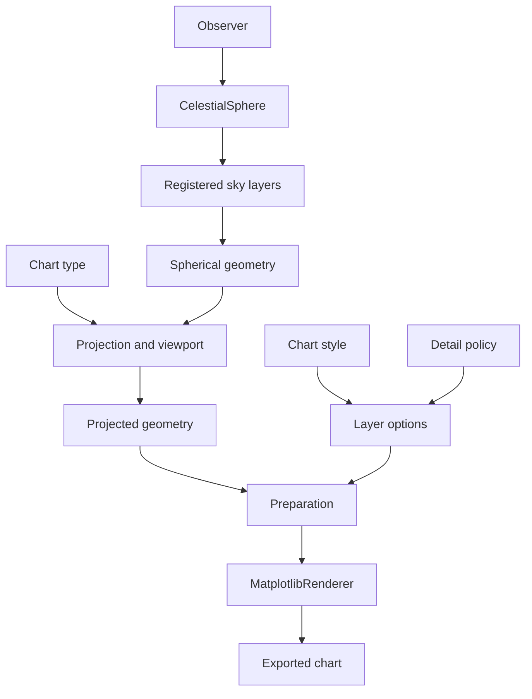

# Wenu Current Architecture v0.4

Status: historical migration baseline
Milestone: 42A
Date: 2026-07-28

## 1. Purpose

This document records the current Wenu architecture after Milestones 39–41.
It describes the implementation as it exists. It does not propose a rewrite.

Wenu is a static astronomical chart-generation package. Its priorities are:

- reproducible publication-quality charts;
- planispheres, circumpolar charts, regional charts, and binocular charts;
- reusable astronomical catalogues and sky layers;
- explicit visual styles;
- print and presentation output modes;
- deterministic export.

## 2. Current pipeline



## 3. Observer

The observer is mandatory in the established public workflow:

```python
observer = Observer(...)
sky = CelestialSphere(observer)
```

The observer supplies:

- geographic location;
- date and time;
- coordinate transformations;
- the observer's AltAz frame;
- zenith and horizon geometry;
- information used for observer-dependent orientation.

The observer does not, by itself, define the chart type, tangent point,
viewport, style, output mode, or detail policy.

## 4. CelestialSphere

`CelestialSphere` registers the astronomical content associated with the
observer. Current layers include:

- stars;
- constellation lines;
- constellation labels;
- constellation boundaries;
- coordinate grids;
- Milky Way isophotes;
- Magellanic Cloud isophotes;
- galaxies;
- globular clusters;
- open clusters;
- planetary nebulae;
- supernova remnants.

Layers produce the existing spherical geometry containers. The celestial
sphere remains the common source used by every chart type and visual style.

## 5. Chart types

The current chart types include:

- planisphere or full-sky chart;
- circumpolar chart;
- rectangular regional chart;
- circular binocular chart.

Chart types define geometry and framing:

- tangent point;
- angular field;
- projection;
- viewport;
- chart boundary;
- position angle;
- north-up or another requested orientation;
- constellation-derived framing where applicable.

For an AltAz planisphere the tangent point is the observer's zenith.

For a regional chart the tangent point may be any position in the observer's
sky. `RegionalChart.from_constellations(...)` derives a suitable center from
the selected constellations. North-up and explicit position-angle behavior are
already supported.

## 6. Projection

Chart classes create the configured coordinate-neutral stereographic
projection. Projection configuration includes:

- tangent longitude and latitude;
- spherical-frame rotation;
- position angle;
- east-west orientation;
- projection radius.

The existing projection mathematics, spherical frames, geometry containers,
and chart projection properties are established functionality.

## 7. Projected geometry and preparation

Spherical geometry is projected into the existing projected containers:

- projected points;
- projected curves;
- projected polygons;
- projected grids.

Generic preparation operates between projection and rendering. Current
preparation includes:

- latitude and horizon clipping;
- projection-cap clipping for full-sky polygon data in regional projections;
- viewport clipping;
- magnitude-dependent stellar sizes;
- per-object styling;
- polygon fill and outline preparation;
- label offsets and placement callbacks.

This preparation layer is already used by both atlas and cartoon charts.

## 8. Renderer

`MatplotlibRenderer` is the common renderer. It translates prepared projected
geometry into Matplotlib artists:

- scatter points;
- line and curve collections;
- polygon patches;
- coordinate grids;
- labels;
- symbol overlays.

Atlas and cartoon charts do not have separate renderers.

## 9. Style, mode, and detail

The architecture now distinguishes four concepts:

| Concept | Responsibility |
| --- | --- |
| Chart type | Projection, geometry, viewport, and chart boundary |
| Chart style | Colors, lines, symbols, typography, and legends |
| Chart mode | Print or presentation sizing and scale factors |
| Detail policy | Magnitude limits, enabled layers, and content density |

`ChartComposition` resolves:

- `ChartContext`;
- chart style;
- `ResolvedMode`;
- `ResolvedDetail`.

It can produce effective layer options with:

```python
application = composition.layer_options(sky)
```

## 10. Atlas path

The atlas examples use:

```text
Observer
→ CelestialSphere
→ chart type
→ AtlasChartStyle
→ chart.export
→ MatplotlibRenderer
```

The example currently creates the figure and renderer, configures the axes,
calls chart export, adds legends, and saves again.

## 11. Cartoon path

The cartoon examples use:

```text
Observer
→ CelestialSphere
→ chart type
→ compose_cartoon_chart
→ composition.layer_options
→ chart.export
→ MatplotlibRenderer
```

The example currently creates the figure and renderer, extracts the resolved
mode and style, applies layer options, exports, and saves again.

## 12. Current architectural gap

Atlas and cartoon charts already share the same observer, celestial sphere,
projection, preparation, chart, and renderer pipeline.

The gap is limited to high-level orchestration:

- `ChartComposition` resolves inputs but does not execute them;
- examples create backend figures and renderers;
- examples coordinate detail application;
- examples coordinate legends;
- examples may save the same product twice.

No lower-level architectural replacement is required to close this gap.
