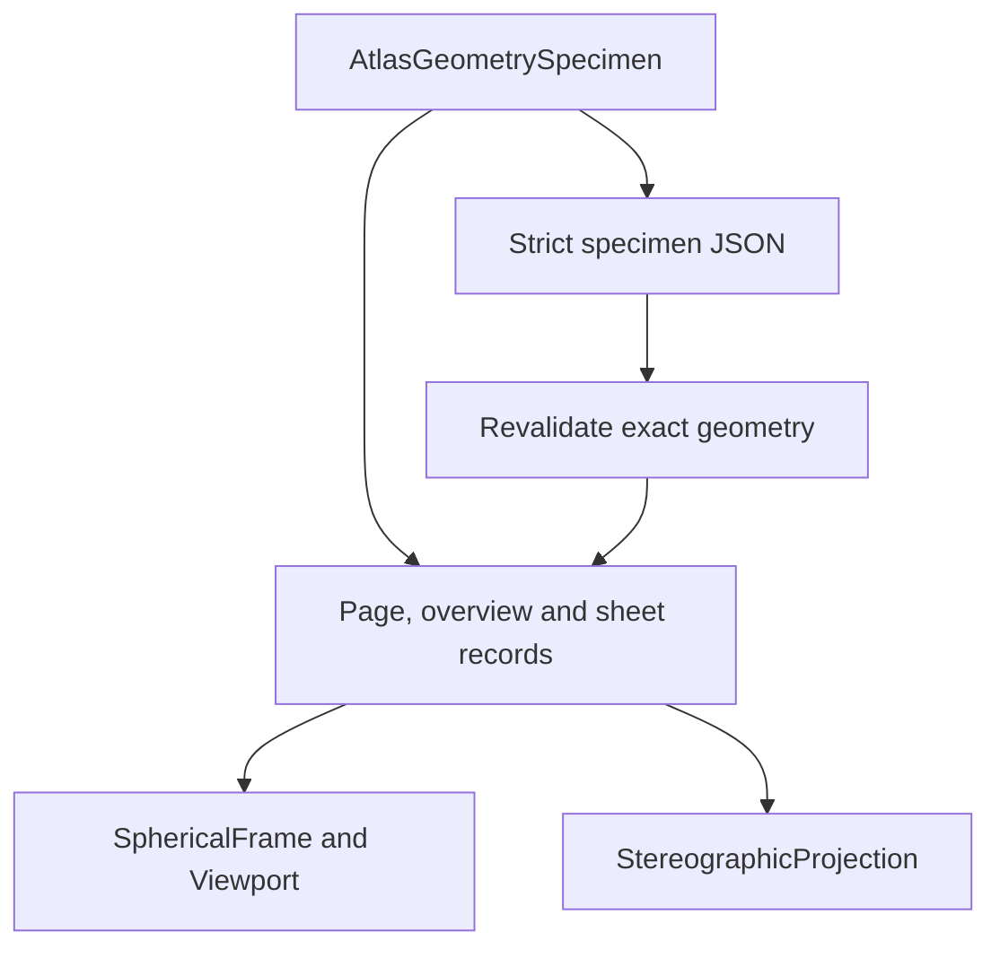
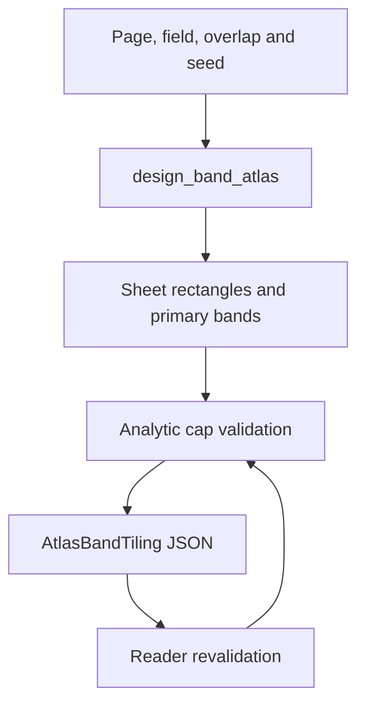
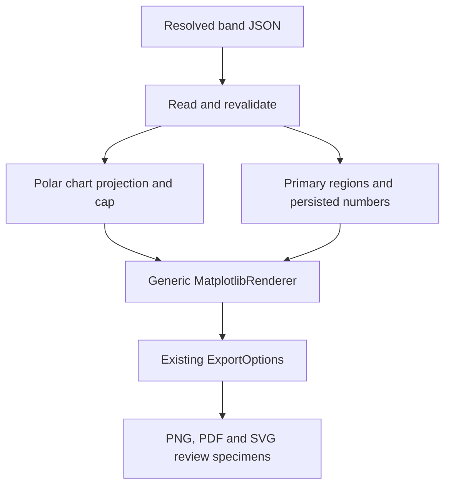
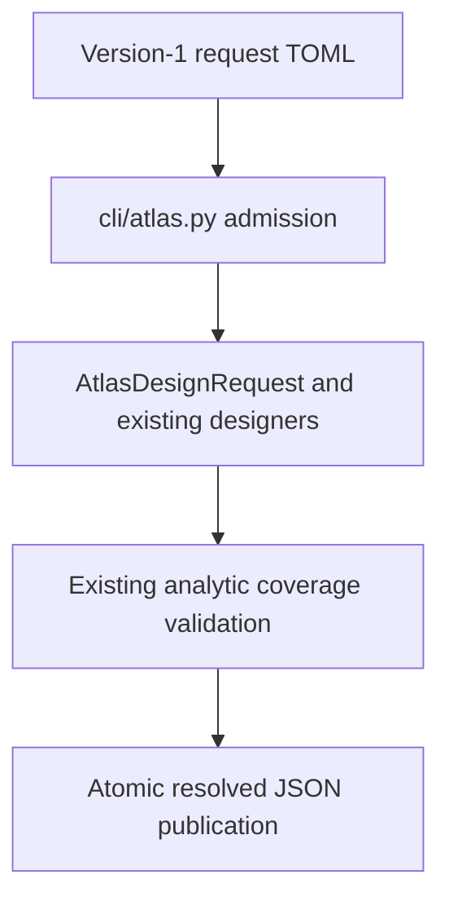
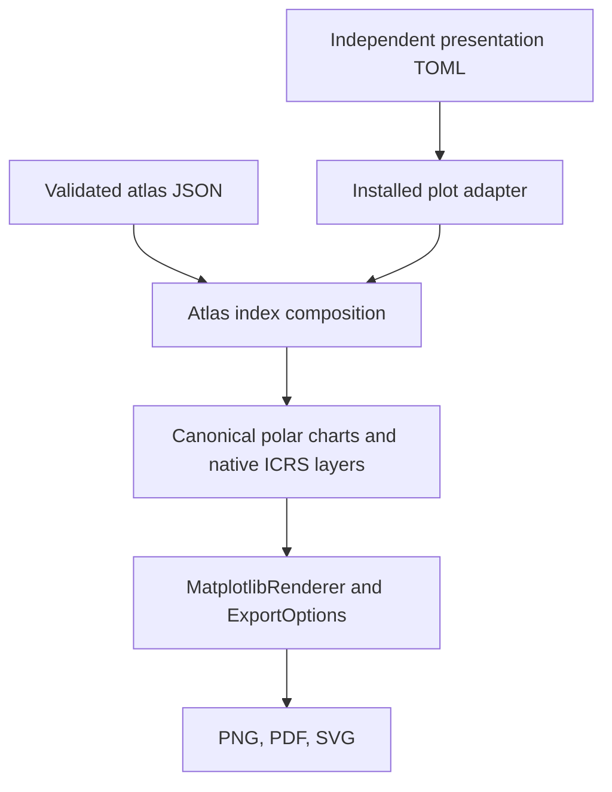

# Wenu architecture diagrams

**Status:** Architecture 0.9.5 diagrams accepted and merged in `1a15076`; v0.9 baseline and 49B/49C planning views retained as history

These diagrams are a human inspection interface for the as-is software. They
are intended to let Fernando inspect architecture ownership, principal data
flow, preserved boundaries, and the exact areas affected by an upcoming
architectural change without first reconstructing the system from source.

## Current diagrams

### Architecture 0.9.5 coordinate authority

[Open the v0.9.5 coordinate transformation SVG](coordinate_transformation_as_is_v0.9.5.svg)

Source: `coordinate_transformation_as_is_v0.9.5.dot`

[Open the v0.9.5 coordinate static-structure SVG](coordinate_static_structure_as_is_v0.9.5.svg)

Source: `coordinate_static_structure_as_is_v0.9.5.dot`

[Open the v0.9.5 coordinate runtime-sequence SVG](coordinate_runtime_sequence_as_is_v0.9.5.svg)

Source: `coordinate_runtime_sequence_as_is_v0.9.5.dot`

These three source-backed views are the accepted 49C.4 inspection authority. Together
they show the actual classes and package placement, inheritance and composition,
and runtime calls or returns after 49C.3. The implemented provider boundary is
`Stars`, `NonStellar`, and `OpenClusters`; constructed grids, planes, poles,
and horizon geometry remain direct reference constructors rather than a
fictitious protocol. `CoordinateService` is the sole production astronomical
transformation owner. The retired handwritten and chart-owned authorities are
absent.

The dashed future-provider note is an extension seam, not an implemented class.
A Moon, planet, comet, asteroid, or satellite provider supplies native typed
positions through `PositionProvider`; it requires only another provider
implementation and does not modify `CoordinateService`, spherical geometry,
projection, clipping, preparation, or rendering.

### Architecture and execution flow

[Open the current v0.9 architecture SVG](current_architecture_v0.9_overview.svg)

Source: `current_architecture_v0.9_overview.dot`

This diagram separates request resolution, astronomical-state realization,
the shared geometry/rendering pipeline, and product orchestration. It shows
which products reuse the canonical path and where observer-local state enters.

### Minor-body state-provider seam

[Open the 50A.1 minor-body provider SVG](minor_body_state_provider_50a1.svg)

Source: `minor_body_state_provider_50a1.dot`

This focused view records the 50A.1 resource-chain and geometric-state provider
seam. The minor-body provider is deliberately unconnected to a body or chart;
its dashed downstream edge is the accepted later direction-realizer boundary,
not current minor-body output.

### Asteroid numerical-validation seam

[Open the 50A.2 asteroid-validation SVG](asteroid_validation_50a2.svg)

Source: `asteroid_validation_50a2.dot`

### Drawable Ceres seam

[Open the 50A.3B drawable-Ceres SVG](drawable_ceres_50a3b.svg)

Source: `drawable_ceres_50a3b.dot`

This focused view shows the explicit manifest-backed resource session and the
descriptor-aware separation between Ceres target state and the DE440 observer
source before both point and track enter Wenu's ordinary projection, rendering,
and export pipeline.

### Installed numbered-asteroid seam

[Open the 50A.3D numbered-asteroid SVG](numbered_asteroids_50a3d.svg)

Source: `numbered_asteroids_50a3d.dot`

This candidate view shows exact local number/name resolution, manifest-derived
request identity, temporary layer registration, and reuse of the existing
minor-body target/observer split and canonical output pipeline.

This focused view records the narrow CSPICE type-21 evaluator, explicit DE440
dependency, existing direction realizers, and independent direct-Horizons
oracle. Its body/chart/output edge remains deliberately disconnected.

### Historical v0.9 coordinate transformations and 49B/49C seams

[Open the coordinate as-is SVG](coordinate_transformation_as_is_v0.9.svg)

Source: `coordinate_transformation_as_is_v0.9.dot`

Red boxes identify the current overlapping transformation authorities and
observer-dependent detour. Green boxes identify the planned ownership seams:

- 49B introduces typed astronomical-state vocabulary and enforceable
  scientific identity;
- 49C introduces one coordinate service and explicit celestial versus
  observer-local transformation paths;
- projection alignment, projection, clipping, and rendering remain
  coordinate-neutral and outside the rationalization.

### Historical coordinate target after 49B/49C

[Open the coordinate target-state SVG](coordinate_transformation_target_49bc.svg)

Source: `coordinate_transformation_target_49bc.dot`

This companion diagram shows the intended ownership after the first coordinate
rationalization:

- every astronomical object obtains its native position through the common
  `PositionProvider` protocol;
- star and deep-sky catalogue providers implement it now, while solar-system
  ephemeris and orbit providers implement the same boundary later;
- constructed grids, planes, and poles remain a separate
  `ReferenceGeometryProvider` family;
- both source families produce existing `Spherical*` geometry carrying one
  immutable `CoordinateSpec`;
- products declare a target `CoordinateSpec` instead of transforming data;
- one `CoordinateService` validates and transforms all geometry kinds while
  preserving topology;
- `ObservationContext` enters only the explicitly observer-local path;
- projection alignment and every downstream rendering stage remain
  astronomically neutral.

`PositionProvider` is the boundary for all astronomical objects, not a
Moon/planet special case. Adding a new object family requires only another
provider implementation; the coordinate service, geometry records, projection,
and renderer do not change.

## Software-engineering views

The coordinate diagrams use three complementary, UML-inspired views. They
must be read together; no single diagram is expected to encode structure,
ownership, and runtime order simultaneously.

### Static structure: historical v0.9 implementation

[Open the current coordinate static-structure SVG](coordinate_static_structure_as_is_v0.9.svg)

Source: `coordinate_static_structure_as_is_v0.9.dot`

This source-backed view names the current Python modules, actual classes,
dataclasses, functions, inheritance hierarchy, composition, and dependencies.
It distinguishes the real `SkyLayer` inheritance tree from the independent
`Spherical*` geometry records.

### Static structure: historical 49B/49C proposal

[Open the proposed coordinate static-structure SVG](coordinate_static_structure_target_49bc.svg)

Source: `coordinate_static_structure_target_49bc.dot`

This is the direct counterpart to the current static-structure diagram. It
retains the same `SkyLayer` inheritance hierarchy, `CelestialSphere`,
`Spherical*` record family, observer, cache, and chart/projection columns.
The deliberately large canvas shows the complete proposed ownership and
linkage: all astronomical-object classes implement the common
`PositionProvider` protocol in `positions.py`; constructed reference
geometry remains distinct; existing `Spherical*` records gain an immutable
`CoordinateSpec`; `coordinate_service.py` is the one `CoordinateService`
owner, while `coordinates.py` retains the immutable vocabulary; and `ObservationContext` is supplied only for observer-local
transformations. The existing `SkyLayer` hierarchy and downstream projection
and rendering classes remain visible and retained. No parallel astronomical
state hierarchy is proposed.

Implemented migration boundary at 49C.2: reference geometry, chart
compatibility conversions, deep-sky geometry, constellation references,
observer caches, and chart-orientation reference directions now use the
service. Skyfield apparent stellar realization remains provider work, and
native AltAz horizon construction remains reference geometry.

49C.3 removes the red legacy `radec_to_altaz()` and chart-wrapper authorities shown in the target planning view. `Observer` now exposes immutable `observation_context`; its ICRS, Galactic, and ecliptic frame properties are gone. The target SVG retains the red retirement boxes as migration history. The v0.9.5 as-is views above replace it as the current inspection authority.

Static-structure notation:

- `inherits`: a real subclass/generalization relationship;
- `contains` or `composes`: lifecycle or value ownership;
- dashed dependency: a call, construction, protocol implementation, or use;
- package boundary: the source directory in which the type or procedure lives.

### Runtime sequence: historical 49B/49C proposal

[Open the proposed coordinate runtime-sequence SVG](coordinate_runtime_sequence_target_49bc.svg)

Source: `coordinate_runtime_sequence_target_49bc.dot`

This sequence view shows one procedure order for every source. Existing layers
and future Moon/planet providers both enter by producing `Spherical*` geometry
with a source `CoordinateSpec`. Its horizontal arrows are runtime calls or
returns, never inheritance. Optional observer context changes only the service
input; the downstream sequence is identical.

## Maintenance contract

The diagrams must be updated whenever a milestone changes any of:

- package or type ownership;
- astronomical frame, origin, epoch, instant, time-scale, or position-status
  responsibility;
- the canonical request, geometry, preparation, rendering, or export flow;
- observer-independent versus observer-local realization;
- product reuse or cache boundaries.

For an architectural migration, preserve an explicit as-is diagram before
implementation, then update the current diagram in the closure milestone.
The before/after diagrams must make moved responsibilities visible rather than
merely changing version labels.

The hand-maintained Graphviz sources are authoritative because automated class
diagrams do not express runtime ownership or scientific meaning. Regenerate
the SVGs from the repository root with:

```bash
dot -Tsvg docs/developer/diagrams/current_architecture_v0.9_overview.dot \
  -o docs/developer/diagrams/current_architecture_v0.9_overview.svg
dot -Tsvg docs/developer/diagrams/coordinate_transformation_as_is_v0.9.dot \
  -o docs/developer/diagrams/coordinate_transformation_as_is_v0.9.svg
dot -Tsvg docs/developer/diagrams/coordinate_transformation_as_is_v0.9.5.dot \\
  -o docs/developer/diagrams/coordinate_transformation_as_is_v0.9.5.svg
dot -Tsvg docs/developer/diagrams/coordinate_static_structure_as_is_v0.9.5.dot \\
  -o docs/developer/diagrams/coordinate_static_structure_as_is_v0.9.5.svg
dot -Tsvg docs/developer/diagrams/coordinate_runtime_sequence_as_is_v0.9.5.dot \\
  -o docs/developer/diagrams/coordinate_runtime_sequence_as_is_v0.9.5.svg
```

The current diagrams complement `../current_architecture_v0.9.md`,
`../implementation_reference.md`, `../source_tree.md`, and
`../archive/audits/coordinate_transformation_audit_09a2afd.md`; they do not replace the
precise contracts in those documents.


## Atlas geometry specimen inspection view (candidate)

This source-backed view adds a geometry/persistence boundary; the existing
coordinate and rendering SVGs remain valid because their owners are unchanged.
There is no edge to a renderer, observer, catalogue or installed atlas command.



Implemented owners: `src/wenu/atlas_design.py`, `geometry/frame.py`,
`geometry/viewport.py` and `projections/stereographic.py`.
The specimen has unverified coverage. Automatic tiling, primary regions,
paired overview composition and chart/report production remain future work.


## Atlas band-coverage inspection view (candidate)

The atlas owner additionally places band centres and stores a primary
partition; its comparison reader validates the persisted cap-bound coverage.
The chart/coordinate SVGs remain current: no astronomical transformation or
renderer edge is introduced. Automatic band tiling and primary regions are now
available as a bounded Python comparison API; paired index composition and
chart/report production remain future work.



## Atlas visual specimen inspection view

The first geometry-only index uses this existing-owner composition:



The developer example orchestrates these owners. Placement is not rerun;
no new rendering or coordinate-service boundary is introduced. Disks are
separate in this prototype. Composed overlap, celestial layers and report/chart
page production remain later work.

## Five-band rectangle comparison inspection

The atlas geometry owner adds an alternate analytic rectangle-edge certificate
before the unchanged resolved-JSON → polar projection → generic renderer →
export route. Five interior ownership bands and two polar sheets replace the
automatically chosen cap-based row count only for this explicitly tagged
comparison. Canonical frame/projection/viewport remain the mathematical owners;
no rendering, coordinate-service or source-tree boundary is added. Inspect
the overview and full-footprint specimen together because minimum boundary
clearance does not imply uniform overlap across the complete rectangles.

## Composed native-ICRS atlas index review (2026-10-09)

Reviewed the current coordinate transformation, static-structure and runtime-
sequence DOT/SVG views against the composed index candidate. Existing source,
typed spherical geometry, alignment/projection, preparation, renderer and
export owners remain authoritative. The 49D.1/49D.2 realization seam now admits
four deliberately migrated static background layers under `NATIVE_ICRS_SPEC`;
this adds a native source-to-existing-projection handoff without requiring an
observer-local transformation. It is not a second astronomical or render flow.
The retained v0.9.5 diagrams predate this optional realization branch; read this
review with the current architecture and coordinate-guide candidate sections.

The tool alone composes page contours and a bisector with export-DPI-aware clip
boxes. Source layers own native Hipparcos epoch and morphology topology;
`CelestialSphere.draw_chart()` owns closed native dispatch/identity checking;
`PolarPlanisphereChart` owns cap/projection and the existing renderer/export
owners draw and save. The full shared sky band cannot be pointwise registered
in both polar projections. No tiling, observer, ephemeris, dependency or new
production-module responsibility is assigned to the page composition.


## Installed atlas designer inspection view (2026-10-09)

Reviewed the existing coordinate/static/runtime views: the new CLI adapter
points inward to atlas geometry and adds no rendering or coordinate-service
edge. Previous specimen views describe historical implementation stages.



The separate overview tool consumes the same JSON; it does not run placement.
The installed plotter and chart/report producer remain subsequent milestones.


### Installed index presentation candidate (2026-10-09)

The designer is accepted in PR #220. The index owner moves from the developer
tool to `charts/atlas_index.py`; the tool becomes a compatibility adapter.
This product flow supplements the unchanged coordinate and projection views:



No edge returns to placement or changes JSON. Catalogue realization uses the
accepted observer-free static ICRS path; figure assembly uses the established
equatorial join and DPI-aware bisector. No coordinate authority is added.


### Publication planning ownership (2026-10-10)

The implemented dependency is `charts/atlas_publication.py` →
`atlas_design.py`: exact-byte design binding and effective invocation admission
use canonical geometry validation and atlas-order selectors. The resulting
immutable plan has no edge to sky construction or rendering yet. Future snapshot,
worker and spread assembly edges remain governed by the publication contract;
existing coordinate-system diagrams need no new astronomical authority.


### Native snapshot dependency boundary (2026-10-10)

The preparation owner remains `sky/maximal_sphere.py`, which calls the original
layer/catalogue loaders. `sky/native_snapshot.py` persists and verifies prepared
records plus exact atlas bytes; explicit reuse maps data and reconstructs local
native facades. Those facades call original layer realization, selection,
projection and rendering authorities. Snapshot persistence introduces no
observer/coordinate transformation, spatial selector or renderer. The installed
index/producer and worker edges remain future integration, not current runtime.
