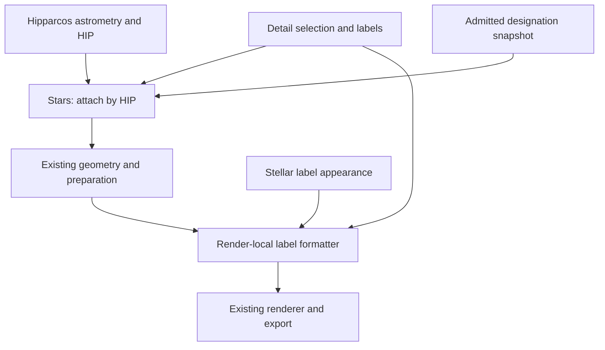

# Stellar Bayer/Flamsteed designation audit

**Status:** Design accepted by Fernando on 2026-10-05, including the amended
selection contract; documentation only. Implementation, catalogue admission
and separately requested merge remain pending.
**Date:** 2026-10-05
**Exact as-is base:** `b929325aeb51fad75193d4216f0e5f8e383fa7ae` on
clean synchronized `main`, as reported by Fernando.
**Scope authorized:** bounded as-is audit and proposal; no production changes,
provider requests during chart construction, catalogue installation or
redistribution, or Gaia integration.

## 1. Outcome and preserved boundaries

Add optional Bayer/Flamsteed labels and explicit name/Bayer stellar selection
to an ordinary `wenu_chart` request. Keep HIP as stable stellar identity and keep
the existing astrometry, celestial-state realization, projection, preparation,
renderer and exporter. Designations are catalogue metadata; their spelling is
not an astronomical coordinate or a new celestial object.

The first implementation should support a declared, immutable HIP-linked
resource and opt-in labels with deterministic text selection. Default charts
retain labels off and unchanged inclusion. Explicit proper-name and Bayer
selection/display are now included, with magnitude-limit bypass. Crowding
optimization, variable/multiple curation and Gaia cross-matching remain later.

## 2. Verified as-is ownership

| Existing owner | Current behavior | Required extension |
|---|---|---|
| `resources.py:catalog_path` | Packaged Hipparcos is the supported stellar catalogue. | Resolve a designation resource separately; do not replace the astrometric catalogue. |
| `objects/stars.py:Stars.load` | Skyfield Hipparcos rows are indexed by HIP; full source and selected catalogues preserve row identity. Classification metadata is already attached by HIP. | Attach validated designation columns by HIP before selection, preserving order/count and original coordinates, magnitudes and classifications. |
| `Stars.position`, `spherical_geometry`, `observed_altaz` | Native ICRS and apparent AltAz routes retain HIP IDs; selected metadata arrays follow the same rows. Observer geometry is cached. No Bayer/Flamsteed labels are supplied. | Transport designation metadata through both routes; do not create a label-only coordinate evaluation or mutate observer caches for presentation. |
| `geometry/spherical.py`, `geometry/projected.py`, `rendering/preparation.py` | Generic collections already carry IDs, labels, names and metadata; preparation subsets per-entity metadata. | Verify alignment through clipping/projection using these existing containers. |
| `charts/detail.py` | Star magnitude/content selection, extra HIP IDs and curated label overrides exist. `CartoonDetail.label_named_stars` is declared, but is not forwarded by its current `resolve` method; `label_density` is not an implemented stellar-name thinning algorithm. | Explicitly resolve designation mode and eligibility; do not infer a working Bayer/Flamsteed route from those fields. |
| `charts/style_components.py:StellarStyle`, `charts/styles.py` | Star symbol sizing/classification overlays exist; normal star options supply markers/overlays, not designation labels. | Add stellar label appearance and preserve the grouped-style to publication-style adapter. |
| `charts/detail_application.py` | Owns render-local selection/options, curated-label formatter and a callable star-render composition for sizing. | Compose detail eligibility, HIP-keyed overrides and label appearance with the existing callable; preserve sizing, overlays, precedence and render isolation. |
| `rendering/matplotlib.py` | Generic point labels prefer labels, then names, then IDs. A formatter returning `None` suppresses a label. | Reuse this path. Never fall back to HIP numbers for missing Bayer/Flamsteed labels. |
| `charts/command_line.py`, configuration translators/validator/defaults | Existing ordinary chart argument and strict schema machinery. | Expose only the bounded new opt-in settings through the existing paths; reject invalid modes/settings rather than silently dropping them. |

Current architecture, target vocabulary, implementation reference, source map,
schema-v2 authority and the coordinate guide were reviewed. The indexed
current architecture/coordinate diagrams preserve the canonical flow and
need no as-built topology change for this documentation-only proposal. The
coordinate guide remains current: designation attachment must not change
state, origin, frame, epoch, equinox, time scale, observer or position status.
No current public API is changed by this audit.

## 3. Catalogue evidence and admission gates

Primary source checked on 2026-10-05:
[Kostjuk IV/27A ReadMe](https://cdsarc.cds.unistra.fr/viz-bin/ReadMe/IV/27A?format=html&tex=true).
The described main table has 3,690 rows; its cross-identifiers are HD, DM,
GC, HR and optional HIP, with separate Flamsteed, Bayer and constellation
fields. The 277-row addendum marks duplicates, designations outside the
current constellation and a nova. Alternative designations, alternative
HD/DM identities and proper names are separate tables. Gaia IDs are absent.

Do not treat every row as a unique HIP star or every alternative as a
preferred label. Preserve original field values, source table/row identity,
flags and reference links. Parse nullable HIP explicitly. Report missing-HIP,
missing-designation, duplicate, conflicting and unmatched entries; never
position-match or silently attach them to another star. Rows sharing a HIP
must remain separate candidate records until a documented preference resolves
them; identical records may be deduplicated with their receipts retained.

Proposed first policy: preferred main-table designations can enter the label
map after the join is verified. Keep historical alternatives and the flagged
addendum as reviewable evidence; do not automatically promote them to preferred
labels or concatenate the addendum into the main table. Produce a conflict
ledger and require an explicit curated decision for contested component or
constellation assignments. Source coordinates may help review but must not
replace Wenu's Hipparcos astrometry. Coverage claims require measured results
from admitted bytes, not the catalogue's advertised row count.

This audit inspected documentation, not a frozen catalogue payload. No
source file hashes, matched-HIP counts or complete scientific mapping are
claimed yet. Admission must freeze exact files, URLs, acquisition date, byte
counts, SHA-256, parser/schema version, transformation policy and validation
summary in a manifest. Download/build is a deliberate acquisition step;
ordinary imports, catalogue loading from an installed snapshot, realization,
rendering and export must not query CDS or another service.

### Rights and publication

The inspected ReadMe supplies bibliographic provenance but no explicit
catalogue redistribution licence. The catalogue landing page exposed an
unresolved licence template in the accessible response, not verified terms.
The [CDS usage/licence page](https://cds.unistra.fr/vizier-org/licences_vizier.html)
linked by VizieR was blocked by robots.txt during this audit. Consequently
redistribution rights remain unverified. This is not a finding that use is
prohibited, nor a grant of rights.

Before shipping catalogue-derived bytes, freeze applicable catalogue/provider
terms or explicit permission and the required attribution. Distinguish local
use of an explicitly supplied resource, distribution of a derived data
snapshot, and publication of original charts/atlas products. Attribution alone
must not be recorded as a verified blanket permission. No contact message was
sent and no catalogue bytes are vendored by this candidate. Parser/join/label
logic can be developed and tested against small synthetic records while this
resource gate is resolved; release of a bundled real dataset and acceptance
of source-derived publication specimens remain gated on the applicable terms.

## 4. Proposed data and module contract

A frozen designation record should retain HIP, supporting HD/HR identifiers,
source Bayer token (Greek abbreviation or Latin letter), component/superscript,
Flamsteed number, designation constellation, preferred/alternative status,
source flags and record/reference provenance. Missing fields are explicit
missing values, never fabricated empty identifiers or numeric zero. Proper
names and reviewed aliases are a separately admitted field family; do not
choose the first historical name as a modern canonical proper name. Validate
name-to-HIP ambiguity and document preferred spellings.

Preserve raw tokens alongside normalized/display forms. Use an explicit Greek
abbreviation map; preserve Latin letters and case, component indices and the
source constellation. Do not infer a Bayer letter from magnitude, sky
position or constellation membership. Render examples such as `α Ori`,
`ι¹ Sco` and `58 Ori` are typography examples, not newly verified HIP joins.
Changing the label form does not change HIP or semantic object identity.

Proposed durable ingestion owner: `src/wenu/star_designations.py` (not yet
created). Its independent responsibility is resource validation, immutable
identity-keyed designation records, conflict reporting and pure normalization;
it imports no Observer, chart, projection, renderer or exporter. Existing
`Stars` owns attachment and row selection. This justifies one small module,
not a new star subclass, provider framework, milestone-named module or
subpackage. `resources.py` retains installed-resource path resolution.

Attach read-only/scalar record provenance plus aligned per-star arrays under
separate designation metadata. Astrometric coordinate-spec provenance remains
Hipparcos/Skyfield; label-source provenance must not masquerade as a position
provider. Load a snapshot once per stellar catalogue load, not per label,
projection or animation frame. Preserve copy/isolation obligations for all
arrays and keep a single immutable source revision.

## 5. Detail, style and ordinary CLI contract (proposed)

The amended contract below was accepted on 2026-10-05; these are not yet
implemented CLI/API capabilities.

### Explicit selection and display

- Repeatable `--star-label-name 'Sco:Antares,Shaula'` resolves, includes and
  labels the requested stars with their admitted proper names.
- Repeatable `--star-label-bayer 'Sco:alpha,beta,gamma,delta,zeta,iota1'`
  resolves, includes and labels stars with their Bayer designations.
- Both selectors bypass the ordinary star magnitude limit, using the existing
  extra-HIP selection machinery. Resolve identifiers before catalogue selection
  and realization. Other stars remain governed by the ordinary magnitude limit.
  Field, altitude, projection-domain and viewport clipping still apply.
- Deduplicate by HIP. Name selection takes precedence over Bayer selection,
  independent of argument order. Existing curated HIP text/suppression overrides
  retain their higher priority. Only explicitly selected stars receive labels
  from these options; neither enables global automatic labels.
- Accept normalized Greek spellings/glyphs and explicit suffixes; preserve
  Latin-letter case. Unknown, unmatched or ambiguous identifiers fail clearly,
  rather than selecting an arbitrary record. No fuzzy or positional matching.
  A resolved target missing from Hipparcos cannot be added by inventing a position.
- `--show-full-bayer-designation` displays `α Sco` instead of `α`, and
  `ι¹ Sco` instead of `ι¹`. Default false. It adds the designation
  constellation abbreviation; proper names and independent constellation labels
  are unaffected.

Equivalent proposed TOML:

```toml
[detail.star_labels]
names = ["Sco:Antares,Shaula"]
bayer = ["Sco:alpha,beta,gamma,delta,zeta,iota1"]
show_full_bayer_designation = false
```

CLI repeated values accumulate per selector. A CLI selector replaces its
corresponding TOML list; an absent selector preserves that list. The boolean
follows existing CLI/config override rules. Initial global Bayer/Flamsteed
modes remain separate opt-in proposals; composition with explicit lists requires
an explicit decision before implementation, not accidental automatic labels.

### Ownership and rendering

Detail owns resolved extra HIP IDs, label eligibility and requested text.
Explicit targets must not be removed by an automatic label magnitude cap.
Reuse existing inclusion/selection and cached astrometry; do not mutate a
shared sphere catalogue for another chart's selection.

`StellarStyle` owns colour, font size, alpha and offset; output mode owns
physical scaling. Keep constellation/title fonts and star sizing independent.
Compose a value-semantic HIP-to-text formatter in existing detail application.
The renderer receives text or `None`, with no catalogue lookup.
Never fall back to HIP numbers for unmatched labels. Leaving geometry labels
unset lets the generic renderer supply HIP to the formatter.

Preserve the existing star-render callable, normalized sizes, variable/multiple
overlays and base/style → detail → explicit call-site precedence. Reuse strict
schema/default/translator machinery. Resource admission is separate; no implicit
provider queries or automatic download. No new collision solver is included.

### Future variable and multiple curation

Wenu already attaches Hipparcos `is_variable`, `is_multiple`, variability
flags and component fields, with optional classification symbol overlays.
Catalogue classification does not determine editorial notability.

Keep inclusion, label text and curated symbol eligibility independent.
A star can receive both classification marks and one label; name/Bayer selection
does not automatically activate either mark. Future curated selectors are not
implemented in this milestone.

Use explicit per-chart reviewed lists with source evidence and a reason for
inclusion. Candidate filters may consider visual amplitude, passband, time scale
and pedagogical/historical interest for variables; separation, magnitude contrast,
instrument context and scientific interest for doubles. No universal threshold
or assumption that all stars qualify is adopted.

Primary sources checked on 2026-10-05:
[AAVSO VSX FAQ](https://vsx.aavso.org/index.php?view=about.faq) distinguishes
photometric ranges, amplitudes and passbands;
[USNO WDS description](https://crf.usno.navy.mil/wdstext) records components,
separations, magnitudes and measurement epochs, and distinguishes physical,
optical and unknown systems. These are future candidate sources, not acquired
resources or new automated access routes.

Preserve system and component-pair identity (AB, AC, etc.) separately from the
HIP of a drawn point; do not assume a one-to-one HIP-to-pair mapping.
Bayer superscripts such as `ι¹` are designation suffixes,
not physical component A/B identities. Missing catalogue classification is
not proof that a star is constant or single. Resolved component geometry,
orbital propagation and time-varying brightness remain separate future science.

## 6. Schematic flow



This diagram shows ownership, not a second render pipeline. Text resolution
and appearance are render options on the same prepared stars; coordinates
remain governed by the existing celestial realization.

## 7. Validation and delivery sequence

1. Record Fernando's 2026-10-05 acceptance of the audit and amended
   selection/display contract. Original head `e47e23e3` passed 240 Mac
   documentation/package-boundary tests in 10.78 s; this amendment needs a fresh
   focused documentation gate.
2. Freeze usable source terms and exact data receipts for the selected resource
   distribution strategy. A local externally supplied snapshot is distinct
   from a bundled database. Close the conflict/coverage ledger before claiming
   real-catalogue completeness.
3. Implement the bounded ingestion/attachment and ordinary label composition,
   preserving labels-off behavior and typed strict settings. No Gaia runtime
   is included; explicit admitted proper-name display is included. Source gates must
   not be bypassed by bundling unverified bytes.
4. Verify the new seams, complete Mac regression, scientific mapping review
   and PNG/PDF/SVG visual/print acceptance before closure.

Closest existing tests: `test_stars.py` for HIP attachment and metadata row
alignment; `test_detail_policy.py` for eligibility/precedence;
`test_style_contracts.py` and configuration translation/overlay tests for
appearance and strict public activation; `test_matplotlib_renderer.py` and
`test_renderer_contracts.py` for generic label suppression and clipping;
`test_render_isolation.py` for shared-sphere order independence; and existing
semantic-SVG tests for stable HIP entity IDs. Extend these for changed seams.
A future `test_star_designations.py` is justified only if the independently
owned resource/parser/conflict lifecycle is admitted; no milestone-named test
file or duplicated astrometry oracle.

Required evidence includes:

- exact record/row normalization, duplicate/conflict/missing-HIP handling,
  hash mismatch and deterministic join independent of catalogue row order;
- the same designation metadata on native and apparent routes after magnitude,
  altitude, projection-domain and clipping selection;
- labels-off output equivalence and unchanged IDs, coordinates, magnitudes,
  classifications and constellation vertices; inclusion stays unchanged without
  selectors and is extended only by resolved explicit HIP targets;
- every label mode, missing-field suppression, HIP-keyed curated overrides,
  below-limit explicit inclusion, name precedence in either argument order,
  repeated selectors, CLI/TOML list replacement, short/full Bayer text,
  ambiguous token errors and ordinary clipping;
- successive differently labelled charts sharing one sphere, with unchanged
  source metadata, style/detail settings and observer geometry cache;
- independent source-backed verification of accepted HIP joins, including
  Latin/Greek tokens, superscripts and genuinely contested/multiple cases;
- regional, binocular and stereographic `wenu_chart` specimens in PNG/PDF/SVG,
  both sky orientations and representative print styles, with Greek/superscript
  glyphs inspected, unchanged constellation/title font sizes and stable SVG
  identity. Physical polar products need a separate bounded closure if their
  composition route introduces a distinct setting seam.

Data facts come from the frozen source records, not image tolerances. Human
review must decide ambiguous catalogue preferences and readability; tests
cannot infer canonical names or legal permission.

## 8. Gaia and later extensions

Kostjuk has no Gaia IDs. A later independently versioned bridge may use
[Gaia DR3 Hipparcos2 best-neighbour metadata](https://gaia.aip.de/metadata/gaiadr3/hipparcos2_best_neighbour/)
to connect HIP to a release-qualified Gaia source ID, retaining match evidence
and ambiguity/coverage status. This is not a universal one-to-one identity
promise. Validate catalogue compatibility, components and missing matches;
keep Gaia ID plus release separate from HIP and designation spelling. No Gaia
query, cross-match, astrometric migration or new Gaia dependency belongs to
the first Bayer/Flamsteed milestone. Explicit proper-name selection/display is
now included with reviewed preferences. Wider historical-alias products and
variable/multiple curation remain later work.
