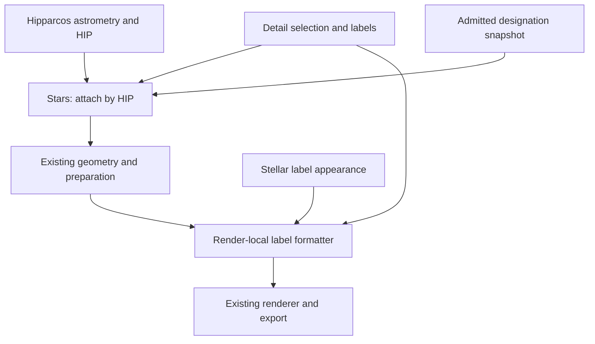

# Stellar Bayer/Flamsteed designation audit

**Status:** Design accepted by Fernando on 2026-10-05, including the amended
selection contract; design merged in PR #204. The expanded source comparison
is recorded in PR #205 together with catalogue incorporation. The Wikidata candidate
resource and HIP attachment were merged in PR #205 (section 10). Fernando approved
the 77-case handling policy after reviewing PR #206; explicit labels, CLI/TOML
and optional chart reports are implemented as a review candidate (section 11).
Scientific questions remain open without blocking this milestone.
**Date:** 2026-10-05
**Exact as-is base:** `b929325aeb51fad75193d4216f0e5f8e383fa7ae` on
clean synchronized `main`, as reported by Fernando.
**Original audit scope:** bounded as-is audit and proposal; no production changes,
provider requests during chart construction, catalogue installation or
redistribution, or Gaia integration.

## 1. Outcome and preserved boundaries

Add optional Bayer/Flamsteed labels and explicit name/Bayer stellar selection
to an ordinary `wenu_chart` request. Keep HIP as stable stellar identity and keep
the existing astrometry, celestial-state realization, projection, preparation,
renderer and exporter. Designations are catalogue metadata; their spelling is
not an astronomical coordinate or a new celestial object.

The first implementation should support a declared, immutable HIP-linked
resource and opt-in labels with deterministic text selection. Default charts
retain labels off and unchanged inclusion. Explicit proper-name and Bayer
selection/display are now included, with magnitude-limit bypass. Crowding
optimization, variable/multiple curation and Gaia cross-matching remain later.

## 2. Verified as-is ownership

| Existing owner | Current behavior | Required extension |
|---|---|---|
| `resources.py:catalog_path` | Packaged Hipparcos is the supported stellar catalogue. | Resolve a designation resource separately; do not replace the astrometric catalogue. |
| `objects/stars.py:Stars.load` | Skyfield Hipparcos rows are indexed by HIP; full source and selected catalogues preserve row identity. Classification metadata is already attached by HIP. | Attach validated designation columns by HIP before selection, preserving order/count and original coordinates, magnitudes and classifications. |
| `Stars.position`, `spherical_geometry`, `observed_altaz` | Native ICRS and apparent AltAz routes retain HIP IDs; selected metadata arrays follow the same rows. Observer geometry is cached. No Bayer/Flamsteed labels are supplied. | Transport designation metadata through both routes; do not create a label-only coordinate evaluation or mutate observer caches for presentation. |
| `geometry/spherical.py`, `geometry/projected.py`, `rendering/preparation.py` | Generic collections already carry IDs, labels, names and metadata; preparation subsets per-entity metadata. | Verify alignment through clipping/projection using these existing containers. |
| `charts/detail.py` | Star magnitude/content selection, extra HIP IDs and curated label overrides exist. `CartoonDetail.label_named_stars` is declared, but is not forwarded by its current `resolve` method; `label_density` is not an implemented stellar-name thinning algorithm. | Explicitly resolve designation mode and eligibility; do not infer a working Bayer/Flamsteed route from those fields. |
| `charts/style_components.py:StellarStyle`, `charts/styles.py` | Star symbol sizing/classification overlays exist; normal star options supply markers/overlays, not designation labels. | Add stellar label appearance and preserve the grouped-style to publication-style adapter. |
| `charts/detail_application.py` | Owns render-local selection/options, curated-label formatter and a callable star-render composition for sizing. | Compose detail eligibility, HIP-keyed overrides and label appearance with the existing callable; preserve sizing, overlays, precedence and render isolation. |
| `rendering/matplotlib.py` | Generic point labels prefer labels, then names, then IDs. A formatter returning `None` suppresses a label. | Reuse this path. Never fall back to HIP numbers for missing Bayer/Flamsteed labels. |
| `charts/command_line.py`, configuration translators/validator/defaults | Existing ordinary chart argument and strict schema machinery. | Expose only the bounded new opt-in settings through the existing paths; reject invalid modes/settings rather than silently dropping them. |

Current architecture, target vocabulary, implementation reference, source map,
schema-v2 authority and the coordinate guide were reviewed. The indexed
current architecture/coordinate diagrams preserve the canonical flow and
need no as-built topology change for this documentation-only proposal. The
coordinate guide remains current: designation attachment must not change
state, origin, frame, epoch, equinox, time scale, observer or position status.
No current public API is changed by this audit.

## 3. Catalogue evidence and admission gates

Primary source checked on 2026-10-05:
[Kostjuk IV/27A ReadMe](https://cdsarc.cds.unistra.fr/viz-bin/ReadMe/IV/27A?format=html&tex=true).
The described main table has 3,690 rows; its cross-identifiers are HD, DM,
GC, HR and optional HIP, with separate Flamsteed, Bayer and constellation
fields. The 277-row addendum marks duplicates, designations outside the
current constellation and a nova. Alternative designations, alternative
HD/DM identities and proper names are separate tables. Gaia IDs are absent.

Do not treat every row as a unique HIP star or every alternative as a
preferred label. Preserve original field values, source table/row identity,
flags and reference links. Parse nullable HIP explicitly. Report missing-HIP,
missing-designation, duplicate, conflicting and unmatched entries; never
position-match or silently attach them to another star. Rows sharing a HIP
must remain separate candidate records until a documented preference resolves
them; identical records may be deduplicated with their receipts retained.

Proposed first policy: preferred main-table designations can enter the label
map after the join is verified. Keep historical alternatives and the flagged
addendum as reviewable evidence; do not automatically promote them to preferred
labels or concatenate the addendum into the main table. Produce a conflict
ledger and require an explicit curated decision for contested component or
constellation assignments. Source coordinates may help review but must not
replace Wenu's Hipparcos astrometry. Coverage claims require measured results
from admitted bytes, not the catalogue's advertised row count.

The original design audit inspected documentation only. Section 9 now records
acquired payloads, hashes, measured joins and source disagreements. These audit
results do not admit a complete scientific mapping. Admission must freeze exact
files, URLs, acquisition date, byte counts, SHA-256, parser/schema version,
transformation policy and validation summary in an installed-resource manifest. Download/build is a deliberate acquisition step;
ordinary imports, catalogue loading from an installed snapshot, realization,
rendering and export must not query CDS or another service.

### Rights and publication

The inspected ReadMe supplies bibliographic provenance but no explicit
catalogue redistribution licence. The catalogue landing page exposed an
unresolved licence template in the accessible response, not verified terms.
The [CDS usage/licence page](https://cds.unistra.fr/vizier-org/licences_vizier.html)
linked by VizieR could not be retrieved during the original design audit; it
was acquired for section 9 and makes commercial rights origin-dependent.
Unrestricted catalogue redistribution rights remain unverified. This is not
a finding that use is prohibited, nor a grant of rights.

Before shipping catalogue-derived bytes, freeze applicable catalogue/provider
terms or explicit permission and the required attribution. Distinguish local
use of an explicitly supplied resource, distribution of a derived data
snapshot, and publication of original charts/atlas products. Attribution alone
must not be recorded as a verified blanket permission. No contact message was
sent and no catalogue bytes are vendored by this candidate. Parser/join/label
logic can be developed and tested against small synthetic records while this
resource gate is resolved; release of a bundled real dataset and acceptance
of source-derived publication specimens remain gated on the applicable terms.

## 4. Proposed data and module contract

A frozen designation record should retain HIP, supporting HD/HR identifiers,
source Bayer token (Greek abbreviation or Latin letter), component/superscript,
Flamsteed number, designation constellation, preferred/alternative status,
source flags and record/reference provenance. Missing fields are explicit
missing values, never fabricated empty identifiers or numeric zero. Proper
names and reviewed aliases are a separately admitted field family; do not
choose the first historical name as a modern canonical proper name. Validate
name-to-HIP ambiguity and document preferred spellings.

Preserve raw tokens alongside normalized/display forms. Use an explicit Greek
abbreviation map; preserve Latin letters and case, component indices and the
source constellation. Do not infer a Bayer letter from magnitude, sky
position or constellation membership. Render examples such as `α Ori`,
`ι¹ Sco` and `58 Ori` are typography examples, not newly verified HIP joins.
Changing the label form does not change HIP or semantic object identity.

Proposed durable ingestion owner: `src/wenu/star_designations.py` (not yet
created). Its independent responsibility is resource validation, immutable
identity-keyed designation records, conflict reporting and pure normalization;
it imports no Observer, chart, projection, renderer or exporter. Existing
`Stars` owns attachment and row selection. This justifies one small module,
not a new star subclass, provider framework, milestone-named module or
subpackage. `resources.py` retains installed-resource path resolution.

Attach read-only/scalar record provenance plus aligned per-star arrays under
separate designation metadata. Astrometric coordinate-spec provenance remains
Hipparcos/Skyfield; label-source provenance must not masquerade as a position
provider. Load a snapshot once per stellar catalogue load, not per label,
projection or animation frame. Preserve copy/isolation obligations for all
arrays and keep a single immutable source revision.

## 5. Detail, style and ordinary CLI contract (proposed)

The amended contract below was accepted on 2026-10-05; these are not yet
implemented CLI/API capabilities.

### Explicit selection and display

- Repeatable `--star-label-name 'Sco:Antares,Shaula'` resolves, includes and
  labels the requested stars with their admitted proper names.
- Repeatable `--star-label-bayer 'Sco:alpha,beta,gamma,delta,zeta,iota1'`
  resolves, includes and labels stars with their Bayer designations.
- Both selectors bypass the ordinary star magnitude limit, using the existing
  extra-HIP selection machinery. Resolve identifiers before catalogue selection
  and realization. Other stars remain governed by the ordinary magnitude limit.
  Field, altitude, projection-domain and viewport clipping still apply.
- Deduplicate by HIP. Name selection takes precedence over Bayer selection,
  independent of argument order. Existing curated HIP text/suppression overrides
  retain their higher priority. Only explicitly selected stars receive labels
  from these options; neither enables global automatic labels.
- Accept normalized Greek spellings/glyphs and explicit suffixes; preserve
  Latin-letter case. Unknown, unmatched or ambiguous identifiers fail clearly,
  rather than selecting an arbitrary record. No fuzzy or positional matching.
  A resolved target missing from Hipparcos cannot be added by inventing a position.
- `--show-full-bayer-designation` displays `α Sco` instead of `α`, and
  `ι¹ Sco` instead of `ι¹`. Default false. It adds the designation
  constellation abbreviation; proper names and independent constellation labels
  are unaffected.

Equivalent proposed TOML:

```toml
[detail.star_labels]
names = ["Sco:Antares,Shaula"]
bayer = ["Sco:alpha,beta,gamma,delta,zeta,iota1"]
show_full_bayer_designation = false
```

CLI repeated values accumulate per selector. A CLI selector replaces its
corresponding TOML list; an absent selector preserves that list. The boolean
follows existing CLI/config override rules. Initial global Bayer/Flamsteed
modes remain separate opt-in proposals; composition with explicit lists requires
an explicit decision before implementation, not accidental automatic labels.

### Ownership and rendering

Detail owns resolved extra HIP IDs, label eligibility and requested text.
Explicit targets must not be removed by an automatic label magnitude cap.
Reuse existing inclusion/selection and cached astrometry; do not mutate a
shared sphere catalogue for another chart's selection.

`StellarStyle` owns colour, font size, alpha and offset; output mode owns
physical scaling. Keep constellation/title fonts and star sizing independent.
Compose a value-semantic HIP-to-text formatter in existing detail application.
The renderer receives text or `None`, with no catalogue lookup.
Never fall back to HIP numbers for unmatched labels. Leaving geometry labels
unset lets the generic renderer supply HIP to the formatter.

Preserve the existing star-render callable, normalized sizes, variable/multiple
overlays and base/style → detail → explicit call-site precedence. Reuse strict
schema/default/translator machinery. Resource admission is separate; no implicit
provider queries or automatic download. No new collision solver is included.

### Future variable and multiple curation

Wenu already attaches Hipparcos `is_variable`, `is_multiple`, variability
flags and component fields, with optional classification symbol overlays.
Catalogue classification does not determine editorial notability.

Keep inclusion, label text and curated symbol eligibility independent.
A star can receive both classification marks and one label; name/Bayer selection
does not automatically activate either mark. Future curated selectors are not
implemented in this milestone.

Use explicit per-chart reviewed lists with source evidence and a reason for
inclusion. Candidate filters may consider visual amplitude, passband, time scale
and pedagogical/historical interest for variables; separation, magnitude contrast,
instrument context and scientific interest for doubles. No universal threshold
or assumption that all stars qualify is adopted.

Primary sources checked on 2026-10-05:
[AAVSO VSX FAQ](https://vsx.aavso.org/index.php?view=about.faq) distinguishes
photometric ranges, amplitudes and passbands;
[USNO WDS description](https://crf.usno.navy.mil/wdstext) records components,
separations, magnitudes and measurement epochs, and distinguishes physical,
optical and unknown systems. These are future candidate sources, not acquired
resources or new automated access routes.

Preserve system and component-pair identity (AB, AC, etc.) separately from the
HIP of a drawn point; do not assume a one-to-one HIP-to-pair mapping.
Bayer superscripts such as `ι¹` are designation suffixes,
not physical component A/B identities. Missing catalogue classification is
not proof that a star is constant or single. Resolved component geometry,
orbital propagation and time-varying brightness remain separate future science.

## 6. Schematic flow



This diagram shows ownership, not a second render pipeline. Text resolution
and appearance are render options on the same prepared stars; coordinates
remain governed by the existing celestial realization.

## 7. Validation and delivery sequence

1. Record Fernando's 2026-10-05 acceptance of the audit and amended
   selection/display contract. Original head `e47e23e3` passed 240 Mac
   documentation/package-boundary tests in 10.78 s; this amendment needs a fresh
   focused documentation gate.
2. Freeze usable source terms and exact data receipts for the selected resource
   distribution strategy. A local externally supplied snapshot is distinct
   from a bundled database. Close the conflict/coverage ledger before claiming
   real-catalogue completeness.
3. Implement the bounded ingestion/attachment and ordinary label composition,
   preserving labels-off behavior and typed strict settings. No Gaia runtime
   is included; explicit admitted proper-name display is included. Source gates must
   not be bypassed by bundling unverified bytes.
4. Verify the new seams, complete Mac regression, scientific mapping review
   and PNG/PDF/SVG visual/print acceptance before closure.

Closest existing tests: `test_stars.py` for HIP attachment and metadata row
alignment; `test_detail_policy.py` for eligibility/precedence;
`test_style_contracts.py` and configuration translation/overlay tests for
appearance and strict public activation; `test_matplotlib_renderer.py` and
`test_renderer_contracts.py` for generic label suppression and clipping;
`test_render_isolation.py` for shared-sphere order independence; and existing
semantic-SVG tests for stable HIP entity IDs. Extend these for changed seams.
A future `test_star_designations.py` is justified only if the independently
owned resource/parser/conflict lifecycle is admitted; no milestone-named test
file or duplicated astrometry oracle.

Required evidence includes:

- exact record/row normalization, duplicate/conflict/missing-HIP handling,
  hash mismatch and deterministic join independent of catalogue row order;
- the same designation metadata on native and apparent routes after magnitude,
  altitude, projection-domain and clipping selection;
- labels-off output equivalence and unchanged IDs, coordinates, magnitudes,
  classifications and constellation vertices; inclusion stays unchanged without
  selectors and is extended only by resolved explicit HIP targets;
- every label mode, missing-field suppression, HIP-keyed curated overrides,
  below-limit explicit inclusion, name precedence in either argument order,
  repeated selectors, CLI/TOML list replacement, short/full Bayer text,
  ambiguous token errors and ordinary clipping;
- successive differently labelled charts sharing one sphere, with unchanged
  source metadata, style/detail settings and observer geometry cache;
- independent source-backed verification of accepted HIP joins, including
  Latin/Greek tokens, superscripts and genuinely contested/multiple cases;
- regional, binocular and stereographic `wenu_chart` specimens in PNG/PDF/SVG,
  both sky orientations and representative print styles, with Greek/superscript
  glyphs inspected, unchanged constellation/title font sizes and stable SVG
  identity. Physical polar products need a separate bounded closure if their
  composition route introduces a distinct setting seam.

Data facts come from the frozen source records, not image tolerances. Human
review must decide ambiguous catalogue preferences and readability; tests
cannot infer canonical names or legal permission.

## 8. Gaia and later extensions

Kostjuk has no Gaia IDs. A later independently versioned bridge may use
[Gaia DR3 Hipparcos2 best-neighbour metadata](https://gaia.aip.de/metadata/gaiadr3/hipparcos2_best_neighbour/)
to connect HIP to a release-qualified Gaia source ID, retaining match evidence
and ambiguity/coverage status. This is not a universal one-to-one identity
promise. Validate catalogue compatibility, components and missing matches;
keep Gaia ID plus release separate from HIP and designation spelling. No Gaia
query, cross-match, astrometric migration or new Gaia dependency belongs to
the first Bayer/Flamsteed milestone. Explicit proper-name selection/display is
now included with reviewed preferences. Wider historical-alias products and
variable/multiple curation remain later work.

## 9. Source comparison and publication freedom (2026-10-05)

**Status:** Complete comparison of the five requested candidates across licensing,
coverage, identity consistency and source quality; candidate documentation in
PR #205, not acceptance of a dataset or of every individual mapping.
**Exact comparison base:** `bf904a284d36a530c2d4ae84619f10a4b43c1f88`.
**Requirement:** Commercial and noncommercial charts and atlas products without
forced output relicensing, royalties or case-by-case publication permission.
CC0 and attribution-only reuse are compared separately. Mandatory attribution
is a condition, but Fernando has not expressly rejected a bibliography credit;
do not turn the publication requirement into an unconfirmed ban on attribution.

Kostjuk is not mandatory. Source permission, scientific adequacy and exact
snapshot integrity are three separate admission checks. The accepted CLI/TOML,
name precedence, magnitude bypass and HIP astrometry remain unchanged.

### Scope, acquisition and measurement rules

Actual complete payloads were acquired for this comparison outside the Wenu
repository. No source catalogue is installed or vendored. HYG's GitHub archive
is **not its current release**: the maintainer moved to Codeberg. This comparison
uses HYG **4.4**, with archived 4.1 measured separately to expose that difference.
The current WGSN web table and its linked NEC CSV are distinct snapshots, not
interchangeable exports of one up-to-date list.

The baseline is Wenu's exact packaged `hip_main.dat`: 118,218 records, 117,955
with both degree-coordinate fields present. Its Git blob SHA-1 is
`6b754eb45ad072622dba7eb6dbdd94df24bae54b`. Counts use source HIP identity
and raw V magnitude; they do not imply all records survive a particular chart's
geometry or viewport. The two illustrative magnitude denominators are 2,851
HIP records at V <= 5.5 and 8,874 at V <= 6.5. Explicit selectors still bypass
magnitude limits, so all-catalogue coverage matters too.

Audit transformation version: **stellar-source-comparison/1**. Read the published
fixed-width schemas for Kostjuk/Yale and CSV headers for HYG/NEC. Parse HIP as
nullable integer; do not use a positional match. Yale has no HIP column: accept
only an HD with exactly one HIP in Wenu's original H71 field. This is a conservative
identity bridge, not proof of physical component equivalence. Retain unmatched
and ambiguous rows; no nearest-neighbour or arbitrary first-record fallback.

Normalize the published Greek abbreviations (including `alf`, `mu.`, `nu.`,
`pi.`), HYG's hyphenated suffixes (`Iot-1`), Unicode superscript digits and
variant epsilon/phi/mu glyphs. Preserve Latin-letter case, numeric suffixes and
all three-letter constellation abbreviations, including mixed case `UMa`,
`CVn`, `PsA`. Expand the web table's `Virginis`/`Bootis` spellings only to the
corresponding abbreviation. Compare sets per HIP, rather than choosing the first
candidate. Physical A/B suffixes remain in the raw record; the base-designation
comparison strips them solely for like-for-like text comparison, not to certify
identical components.

The so-called Bayer columns also contain variable-star designations. Exclude
uppercase R-Z and multi-letter/numbered variable tokens from the Bayer count;
keep them as a distinct field family. Kostjuk has 134 such non-Bayer populated
rows, and the WGSN column has 10 entries outside the supported Bayer syntax
(including two HIP identifiers). Yale has 12 nonstandard populated name tokens;
one Wikidata Flamsteed-qualified statement says `184 Carinae` and is retained
for review rather than silently normalized into a Flamsteed number.

Kostjuk table3 is joined by **HD and exact BFD**, not HD alone: 807 source rows
are historical spellings/aliases, not 807 uniquely named stars. Preferred names
are not inferred. Addendum (277 rows), alternative designations (1,226 rows),
alternative identities (58 rows) and 26 reference records were inspected
separately and excluded from preferred-main-table coverage. Yale's full notes
were acquired; its 497 name-category lines concern 439 HR records, contain
free-text alternatives and are not a canonical proper-name column.

Wikidata measurements use catalog-qualified P528 statements, P972 catalogues
Q105616 (Bayer), Q111116 (Flamsteed), and Q537199 (HIP). Keep statement IDs,
ranks, raw codes, reference IDs and HIP evidence. Eight deprecated designation
statements are excluded from joined candidate maps but retained in quality
counts. A separate check of every HIP-prefixed P528 statement on these items
found 3,498 HIP statements, all correctly catalogue-qualified; omitted joins
are not explained by missing HIP qualifiers in this snapshot. System/component
items can carry the designation and HIP on different entities.

English Wikidata labels/aliases are compared with **the 567 WGSN rows containing
HIP**, including both names for one shared HIP; these are lexical availability
checks, not official-name assignments. They are not a census of every name in
Wikidata. All joins and discrepancy counts below were computed over the full
stated payloads; representative conflicts were inspected. No externally certified
gold standard exists here, so agreement is **not an accuracy percentage** and
not every conflict has been adjudicated.

### Measured coverage

Counts below are distinct HIPs with the relevant field after the rules above.
Yale's join is bridged; the other primary table joins are direct. A raw name is
not necessarily an IAU-approved preferred name. A dash means the field was not
measured as a structured canonical-name resource, not that the source has no names.

| Source | Raw rows/statements | Joined distinct HIP | HIP with Bayer | HIP with Flamsteed | HIP with names/aliases |
|---|---:|---:|---:|---:|---:|
| Kostjuk main + table3 | 3,690 | 3,567 | 1,980 | 2,681 | 333 |
| Yale BSC5, unique HD bridge | 9,110 | 8,987 | 1,518 | 2,503 | — |
| HYG 4.4 | 119,614 | 117,951 | 1,523 | 2,724 | 535 |
| WGSN current web table | 640 | 566 | 411 | 52 | 566 |
| Wikidata qualified statements | 4,864 | 3,494 | 1,928 | 2,744 | — |

Join limitations: Kostjuk has 121 rows without HIP and two repeated HIPs;
Yale has 8,987 unique-HD joins, 14 rows without HD, 98 without a corresponding
HIP and 11 with ambiguous HD. HYG 4.4 has 1,663 non-HIP rows, including the Sun
and supplementary stars. WGSN has 73 blank HIP rows and 567 HIP-bearing rows
on 566 HIPs. Wikidata has 167 designation statements without a usable HIP join.
All joined HIP identifiers occur in Wenu's raw catalogue; this alone does not
validate their physical identity or their availability after coordinate selection.

HYG 4.1 had 119,626 rows, 1,522 Bayer HIPs, 2,724 Flamsteed HIPs and 450 named
HIPs. HYG 4.4 has 119,614 rows and 535 named HIPs: using the archived version
would materially understate current proper-name coverage. The maintainer
explicitly documents unofficial secondary names and selected Latin-label policy;
HYG is a curated compilation, not a complete historical Bayer index.

The linked WGSN NEC CSV contains 9,297 rows, 377 populated names and 8,990
populated HIP fields on 8,817 distinct field strings. Its rows include unnamed
stars, systems and supplements; it does not reproduce the current web table's
640 named records or its recent approvals. These CSV figures use the supplied
field strings, not an independently admitted component-to-HIP map.

| Source | Bayer HIP at V <= 5.5 | Flamsteed HIP at V <= 5.5 | Bayer HIP at V <= 6.5 | Flamsteed HIP at V <= 6.5 |
|---|---:|---:|---:|---:|
| Kostjuk | 1,686 | 1,671 | 1,947 | 2,544 |
| Yale BSC5 | 1,309 | 1,640 | 1,504 | 2,460 |
| HYG 4.4 | 1,308 | 1,639 | 1,504 | 2,483 |
| WGSN web table | 402 | 44 | 410 | 51 |
| Wikidata | 1,650 | 1,642 | 1,904 | 2,501 |

A star without a designation is not automatically missing from a source;
most HIP stars never had Bayer/Flamsteed designations. WGSN's small designation
counts reflect its proper-name scope, not incompleteness as a general star catalogue.
Kostjuk retains 460 Latin-letter Bayer **rows** under the stated variable-token
exclusion; row counts and distinct-HIP coverage must not be interchanged.

### Full pairwise consistency comparison

Each cell is **same normalized set / common HIPs**. Both sources must have
that designation field. A superset of historical alternatives counts as a
set difference; lack of the field is a separate coverage gap. No preference
or error rate is inferred from majority agreement.

| Pair | Bayer agreement | Flamsteed agreement |
|---|---:|---:|
| Kostjuk / BSC | 1,466 / 1,499 | 2,502 / 2,502 |
| Kostjuk / HYG | 1,471 / 1,504 | 2,594 / 2,596 |
| Kostjuk / WGSN | 398 / 409 | 52 / 52 |
| Kostjuk / Wikidata | 1,831 / 1,890 | 2,540 / 2,551 |
| BSC / HYG | 1,516 / 1,516 | 2,501 / 2,502 |
| BSC / WGSN | 398 / 406 | 49 / 49 |
| BSC / Wikidata | 1,426 / 1,452 | 2,398 / 2,409 |
| HYG / WGSN | 397 / 405 | 50 / 50 |
| HYG / Wikidata | 1,431 / 1,457 | 2,614 / 2,625 |
| WGSN / Wikidata | 383 / 391 | 51 / 51 |

Kostjuk versus Wikidata: 90 Bayer HIPs occur only in Kostjuk, 38 only in
Wikidata, with 59 set differences on their common HIPs. For Flamsteed the
corresponding figures are 130, 193 and 11. HYG versus Yale agrees on all 1,516
common Bayer HIPs; HYG versus Kostjuk has 33 set differences. That agreement
is not independent validation: HYG explicitly derives many designations from
Yale. Shared ancestry and imported catalogue/Wikipedia references weaken any
majority-vote claim.

Proper-name comparison against WGSN's 567 HIP-bearing rows: HYG 4.4 has a
nonempty proper field at 504 rows and an exact name match at 498; Kostjuk's
historical aliases contain the exact current spelling at 205 rows. Wikidata
has HIP-bearing items for all 566 target HIPs, but only 118 WGSN names occur as
an exact English label and 403 as an exact English label **or alias**. Seven
HIPs appear on multiple Wikidata entities in this subset. These exact lexical
checks do not repair transliteration, component scope or incorrect source joins.
They demonstrate why generic English labels cannot implement canonical name
selection, and why newer names need a controlled refresh policy.

### Accuracy, reference quality and concrete conflicts

| Source | Scientific/operational strength | Limitation affecting admission |
|---|---|---|
| Kostjuk | Purpose-built cross-index, direct HIP, extensive Latin designations, separate historical alternatives and bibliographic name references. | Older compilation with amendments; mixed variable/Bayer field, missing HIPs, superscript/component disagreements, no per-row truth certification. Main table and addendum have different roles. |
| Yale BSC5 | Established bright-star catalogue; HR identity, multiplicity/variable fields, extensive notes and documented corrections. | Fifth preliminary edition is an older resource, main table lacks HIP and structured canonical names. HD can denote a system rather than one component. |
| HYG 4.4 | Current maintained, convenient explicit HIP/name/Bayer/Flamsteed columns and documented repairs; recent official-name updates. | Dependent compilation, selective Latin labels, unofficial companion names, incomplete current WGSN name coverage. Its newer astrometry must not replace Wenu's astrometry in this feature. |
| IAU/WGSN | Authority for officially approved proper names, adoption dates, spelling and cultural origins; 110 web-table rows have 2026 adoption dates. | Naming authority is not an all-star designation catalogue. Web/CSV synchronization, identity/components and coordinate fields need validation. Do not copy origin prose into label metadata. |
| Wikidata | CC0 structured records, statement identity, ranks, qualifiers and references; broad Bayer/Flamsteed coverage. | Mutable/indexed source; split system/component entities, inconsistent canonical-name availability, historical aliases, weak or absent references. A query snapshot is not an entity-revision-frozen release. |

Wikidata's 4,864 unique designation statements comprise 2,037 Bayer and 2,827
Flamsteed statements on 3,635 items (4,866 query bindings before deduplication).
331 Bayer statements and 2,103 Flamsteed statements have no reference node.
The reference-property census includes 1,515 statement/reference/property rows
imported from English Wikipedia, 28 from Japanese Wikipedia, and 854 stating
SIMBAD as source. Those are evidence-property rows, not counts of independently
verified stars; one statement can have more than one evidence property. Presence
of a SIMBAD reference is stronger provenance than an import, not a correctness
certificate. The joined candidate maps have six HIPs with multiple Bayer texts
and eleven with multiple Flamsteed texts.

Representative review ledger (raw source rows remain outside the repository):

| Case | Observed source evidence | Consequence |
|---|---|---|
| Antares / Shaula / iota1 Sco | HIP 80763 / 85927 / 87073 have matching Bayer forms across Kostjuk, Yale, HYG and Wikidata; Antares/Shaula proper names agree with WGSN. | Suitable uncomplicated regression candidates after rights and component checks. Superscript parsing is required. |
| Acrab, HIP 78820 | Kostjuk/Yale/HYG/WGSN identify beta1 Sco. Wikidata names HIP 78820 on Q66477350; the qualified Bayer/Flamsteed census places the designation on the separate Beta Scorpii system Q1043118, which has no HIP in that census. | Do not infer that an item with a system name and an item with HIP are identical. Add an independently evidenced relationship before joining. Bare beta can be ambiguous. |
| gamma Ari, HIP 8832 | Kostjuk gamma1; Yale/HYG gamma2; Wikidata gamma without suffix. | Superscript disagreement needs component evidence; no majority-choice shortcut. |
| HIP 89153 | Kostjuk/Yale 11 Sgr; HYG 1 Sgr; Wikidata normal-rank 1 Sgr and deprecated 11 Sgr. | Rank is not a scientific oracle. Resolve with independent evidence before accepting either as preferred. |
| Izar / Pulcherrima, HIP 72105 | WGSN has Izar on epsilon Boo and Pulcherrima on epsilon Boo B, sharing HIP with different HR/component metadata. | Keep named component identity separate from the drawn HIP point; two names are not necessarily interchangeable aliases. |
| Zibbatu / 112 Psc, HIP 9353 | Kostjuk/Yale/HYG/Wikidata agree on 112 Psc; WGSN's row also says HR 7203 and RA 285.7658552, inconsistent with this HIP's position and HR 582 in the comparison catalogues. | Quarantine the discrepant fields. Naming authority does not justify using that coordinate or silently changing the HIP. |
| p Eri, HIP 7751 | HYG 4.4 changes the Latin label and component HR association relative to 4.1; maintainer documents the repair. | Exact version and physical component evidence matter even if the base Latin text is stable. |
| Historical Flamsteed alternatives | Ten of the eleven Kostjuk/Wikidata Flamsteed set differences contain the same Kostjuk value plus another historical designation; HIP 89153 is the other case. | Separate preferred and historical aliases; a set difference is not automatically an erroneous value. |

The WGSN web table yields 16 HIP-bearing rows whose supplied RA/Dec differ
from Wenu's catalogue by more than 60 arcsec; Alsephina and Mira's corresponding
coordinates are repeated in the NEC CSV. This is a **diagnostic flag**, not an
astrometric accuracy test: no epoch/proper-motion/component correction was
applied. Very large disagreements (such as Zibbatu) merit manual checking.
Every source remains metadata-only; preserve Wenu's coordinates throughout.

### Licensing and publication matrix

Primary terms were inspected again on 2026-10-05. The CDS page was successfully
retrieved during this expanded comparison, superseding the earlier retrieval
failure. It allows scientific use with original-source citation and makes
commercial terms depend on the origin catalogue; it is not a blanket unrestricted
commercial redistribution grant. Neither acquired Kostjuk nor Yale ReadMe
supplies the missing dataset-specific grant.

| Source | Verified primary-source evidence | Distributed derived designation resource | Original charts / commercial atlas |
|---|---|---|---|
| Kostjuk IV/27A | Bibliographic ReadMe; CDS scientific-use policy with origin-dependent commercial rules. | Unrestricted grant not established. Attribution alone is not documented clearance. | Commercial permission remains unresolved; no claim that publication is prohibited. |
| Yale BSC V/50 | Author/catalogue ReadMe and CDS policy; no explicit dataset-specific public-domain/unrestricted grant located. | Not established. NASA/HEASARC hosting or another application's public-domain assertion cannot supply it. | Same unresolved commercial-source scope; catalogue age alone does not answer it. |
| HYG 4.4 (also 4.1) | Maintainer's explicit CC BY-SA 4.0 documentation and LICENSE. | Commercial distribution permitted subject to applicable attribution and ShareAlike obligations. Does not meet condition-free data reuse. | Do not assert every original chart or enclosing book inherits BY-SA. Obligations depend on protected material/rights actually used; avoid an uncertain exemption as the default publication strategy. |
| IAU/WGSN | IAU's current copyright page explicitly grants CC BY 4.0 for images, videos and web text **on iau.org**. Current table/CSV are hosted on **exopla.net**, whose inspected index/imprint do not explicitly apply that grant to these payloads. | CC BY is an attribution-only possibility, but applicability to the chosen exopla payload is still unconfirmed. A third-party processor's licence cannot answer it. | CC BY-covered IAU material permits commercial reuse with credit and no ShareAlike; establish the exact dataset scope first. |
| Wikidata structured data | Wikidata Copyright/Licensing and Query Service policies: CC0 for structured data. | Best established condition-free candidate for the contributor's applicable rights; source restrictions cannot be laundered through a bulk import. | No mandatory attribution or ShareAlike under CC0 for those rights; voluntary scientific provenance remains recommended. No guarantee of correctness or third-party rights clearance. |

Primary links: [CDS terms](https://cds.unistra.fr/vizier-org/licences_vizier.html),
[Kostjuk ReadMe](https://cdsarc.cds.unistra.fr/ftp/IV/27A/ReadMe),
[Yale ReadMe](https://cdsarc.cds.unistra.fr/ftp/V/50/ReadMe),
[current HYG maintainer](https://codeberg.org/astronexus/hyg),
[HYG 4.4 documentation](https://codeberg.org/astronexus/hyg/src/commit/53e3df311869e813ace5f1ad2ec4ce909f13256c/data/hyg/README.md),
[WGSN table](https://exopla.net/star-names/modern-iau-star-names/),
[WGSN downloads](https://exopla.net/iau-wgsn-catalogs/),
[WGSN imprint](https://exopla.net/imprint/),
[IAU copyright](https://www.iau.org/IAU/IAU/Copyright.aspx),
[Wikidata copyright](https://www.wikidata.org/wiki/Wikidata:Copyright),
[Wikidata licensing](https://www.wikidata.org/wiki/Wikidata:Licensing),
[CC BY-SA legal code](https://creativecommons.org/licenses/by-sa/4.0/legalcode.en),
[CC0 legal code](https://creativecommons.org/publicdomain/zero/1.0/legalcode.en).

A database, software licence, original chart and enclosing atlas are different
works. Exceptions and uncopyrightable facts do not justify an unqualified
clearance of a whole imported compilation. CC0 only waives rights held by the
affirmer; it does not clear trademarks or third-party rights. This comparison
is not legal advice; it is not a rights clearance for every existing Wenu
catalogue, artwork, font, ephemeris or exported product. Scientific credits can
live in the manifest and bibliography; they are useful even when not mandatory.
No author/provider permission request was sent.

### Recommended source strategy and remaining decisions

There is **no single proven turnkey winner** across all four dimensions.
Wikidata is the best rights starting point, **not yet a scientifically admitted
snapshot**. Kostjuk is the strongest measured extended Bayer comparison here;
Yale supplies bright-star and component/notes evidence; WGSN supplies official
name authority; HYG is a useful maintained compilation with clear but different
licensing obligations. Use these roles explicitly, not interchangeable scores.

Recommend a field-wise, immutable HIP-linked resource with raw evidence,
preferred/alternative status, named component scope and independent label text.
Admit reviewed CC0 statements only after resolving split entities, reference
weakness, contested suffixes and missing current names. Compare with primary
scientific sources; do not copy a restricted compilation wholesale. **Do not
silently backfill a CC0 resource** from HYG/Kostjuk/Yale bytes. If official names
are sourced under a verified CC BY grant, retain that field's attribution and
licence separately; do not mark the combined resource wholly CC0.

Before implementation admission, decide between (a) a strictly CC0 resource
with a documented, independently supported curated complement, or (b) an
attribution-only official-name supplement after its payload licence is confirmed.
If required scientific coverage cannot be achieved on those terms, obtain an
explicit suitable source grant or reduce the admitted coverage openly. Current
unknown source permissions are recorded gaps, not evidence of a prohibition.

Close a concrete admission ledger: review missing joins, resolve designation
ambiguities (including bare beta/zeta and historical gamma Sco), establish
canonical names/components, record independently verified corrections, freeze
entity revisions or immutable source releases, and approve exact resource terms.
No live lookup during chart construction, no positional substitution, no Gaia
migration, and no promotion of catalogue variability/multiplicity to editorial
notability. A default HIP label must never hide a missing admitted designation.

### Acquisition receipts and reproducibility boundary

All file hashes below are full SHA-256 over the received bytes, including gzip
compression where shown. Retrieval dates/times are UTC on 2026-10-05. These
are audit receipts, not a licence or an installed-resource manifest. Raw payloads
and temporary analysis scripts remain outside the repository; this document
preserves the measured results, schemas, query scopes and receipts. A future
admitted resource must persist legally distributable input bytes and its tested
transformation, not claim exact reproducibility from a mutable endpoint alone.

Source URLs: Kostjuk files are under
`https://cdsarc.cds.unistra.fr/ftp/IV/27A/`; Yale files under
`https://cdsarc.cds.unistra.fr/ftp/V/50/` (the `bsc-` prefix below is a local
receipt label). HYG 4.4 uses Codeberg commit
`53e3df311869e813ace5f1ad2ec4ce909f13256c`, with data at
`data/hyg/CURRENT/hyg_v44.csv.gz` via `/media/commit/` and documentation via
`/raw/commit/`. HYG 4.1 uses GitHub commit
`c7f7f883fe678cc7680169a50ccd7dcc49b060ce`, file
`hyg/CURRENT/hygdata_v41.csv`. WGSN HTML URLs are linked above; NEC is
`https://exopla.net/wp-content/uploads/2025/05/NEC.csv`.

| Acquired payload | Bytes | Retrieved UTC | SHA-256 |
|---|---:|---|---|
| kostjuk-ReadMe | 11,980 | 22:53:15 | `a88f0b63e8c08dd835e90cbfa6856ed8b24ec71f4e11ecadab9ea90d08adc6b4` |
| kostjuk-catalog.dat | 287,820 | 22:53:26 | `bc2292ddad544c1daefe8f12c6ed47a051006632d84e4a03b36d41f07d626289` |
| kostjuk-table3.dat | 81,507 | 22:53:35 | `256498cb7dd37ec7a3cbb0f46d558e059ad08cd652e8789408c7699206664a0d` |
| kostjuk-addendum.dat | 21,606 | 22:53:42 | `4ec13c5757d07e693368e3934425f9b07f5c0afc8eb416b454dc71ca6c9403a1` |
| kostjuk-table1.dat | 79,690 | 22:53:51 | `c5cf86c041fdbc26e000a32b96ad966f6075fc1013ce0e0f5dd2531e01574790` |
| kostjuk-table2.dat | 5,800 | 22:53:57 | `2871b936f2457315c2d663fc6ce196be73a2cdecdceb23db1080ab5944b58c20` |
| kostjuk-refs.dat | 2,341 | 22:54:05 | `d6d43f3e272892f9297bf88e3d80e666d7df92c29dff1843ae3c0e6ad4ba47de` |
| bsc-ReadMe | 11,571 | 22:54:11 | `44fd9c73e2eecad0beb47bdfa3f01c60fd43f93d6964198e31fcd48732de5b33` |
| bsc-catalog.gz | 573,921 | 22:54:35 | `3dc44b1e90be8fbe5bcc7656032560f51275f985c7e3f783c9028e1838ec7bed` |
| bsc-notes.gz | 161,634 | 22:54:47 | `d489d8ceaead65b0af8bce36f2421886782bbe953ecf76b08bc3fd4b84df1405` |
| hyg-v41.csv | 33,932,548 | 22:54:54 | `d9f69fd86bbf90a4e4d52b4c5c53eacfa6dfc0bfdef85bfd94f095e0bebe4ebd` |
| hyg-v44.csv.gz | 13,636,362 | 23:04:17 | `00b349893b9a53106dd488d8371e8d2fa586043e500bb3cdb8bff3931682197d` |
| hyg-v44-README.md | 8,442 | 23:04:01 | `bb0196ad0791b5cec1cc59b16100c64ff80afb829c770284ca99c999916f4039` |
| hyg-v44-version-info.md | 20,146 | 23:04:09 | `380a4d4f53acc1dc134b9596cfe01603fddb3b5570b16f0381098ac2b9021f85` |
| hyg-current-LICENSE | 422 | 23:03:49 | `f404190403d31e0ce7223f4cb7af954485ad88077358330754dc5c892a856627` |
| wgsn-current.html | 655,323 | 22:55:16 | `f8bbf4dd911cbcf60b5b32fa8c68c3ffb6d7d15b261fdc69d259cf962d4b0203` |
| wgsn-NEC.csv | 986,439 | 22:58:56 | `cf06ae6b8f4f2452c7b797e63116f81a3ff39b1cda72163a75b3adbaa1332b5e` |
| cds-licences.html | 9,428 | 22:53:07 | `f6bab16f7060f41c98958f0044fa3a526eeeeacdd23cb2fa7a529016d2b29e9f` |
| iau-copyright.html | 70,037 | 22:55:11 | `e73b34ca9dae7adfc4c133aadafa5ba10ee8fda15725a56224cbd0f4aaf5778c` |
| wikidata-copyright.html | 103,710 | 22:55:37 | `ea7068a669736483c4cfe94f4a5a7b791b0466e3c275c479f2bfbad3ec5f6b8a` |
| wikidata-designations.json | 5,412,191 | 22:58:45 | `a341c42bb1dc4739c26634fc92f475ebd880254deb55851e0c4c12ee2b4a2697` |
| wikidata-designation-references.json | 1,332,219 | 23:02:21 | `21ebab374a2e39a449430e37a5760b39cbc2a5363aa24e752a06bd4beee30cd2` |
| wikidata-hip-audit.json | 2,047,243 | 23:06:24 | `5f84d4da76b3586d462f344ea32a734ee8c15f6332e20e734f46d91c82a5c1a5` |
| wikidata-named-targets-1.json | 725,086 | 23:02:50 | `daea35cc9741df028c85881c9cd4d712327df60d35a06129af6130808ab8228f` |
| wikidata-named-targets-2.json | 696,196 | 23:02:58 | `82a37fd9412c23b93703a4ecdaed6ad1e586b9dbd32a047ff84da59e2e9ecb5b` |
| wikidata-named-targets-3.json | 679,275 | 23:03:05 | `3ae61b862cc4266370405d97506095e65240b7a394678b2be25db2819c50c29e` |
| wikidata-named-targets-4.json | 90,035 | 23:03:12 | `52648a6c65e0f08f7188f68f460781e514941f00c6fa683254584d3b453879c7` |

Wikidata endpoint: `https://query.wikidata.org/sparql`, GET with URL-encoded
`query` and `format=json`. The full designation query, using standard Wikidata
prefixes, was:

```sparql
SELECT ?item ?label ?statement ?code ?catalog ?rank
       ?hipstatement ?hip ?hiprank ?reference WHERE {
  VALUES ?catalog { wd:Q105616 wd:Q111116 }
  ?item p:P528 ?statement .
  ?statement ps:P528 ?code; pq:P972 ?catalog; wikibase:rank ?rank .
  OPTIONAL {
    ?item p:P528 ?hipstatement .
    ?hipstatement ps:P528 ?hip; pq:P972 wd:Q537199;
                  wikibase:rank ?hiprank .
  }
  OPTIONAL { ?statement prov:wasDerivedFrom ?reference . }
  OPTIONAL { ?item rdfs:label ?label . FILTER(LANG(?label)="en") }
}
```

Reference census: select distinct statement/reference/predicate/value through
`prov:wasDerivedFrom` for the same catalogue-qualified statements; restrict
predicate URI prefix to `http://www.wikidata.org/prop/reference/`. HIP check:
select distinct item/HIP-statement/code/catalogue/rank for the same items,
filter code with `^HIP[ ]*[0-9]`, preserve optional P972. Name queries: sorted
distinct nonblank HIPs from the 567 WGSN rows, split into batches of 180,180,180,26;
match exact `HIP <integer>` P528 codes qualified Q537199, exclude deprecated
HIP statements, retrieve English rdfs:label and skos:altLabel. Preserve item
identity and compare exact name strings rather than assigning a canonical name.

Provider preflight: [Wikimedia API policy](https://foundation.wikimedia.org/wiki/Policy:Wikimedia_Foundation_API_Usage_Guidelines),
[API etiquette](https://www.mediawiki.org/wiki/API:Etiquette),
[Query Service manual](https://www.mediawiki.org/wiki/Wikidata_Query_Service/User_Manual),
plus the source terms linked above were reviewed before requests. The audit used
serial bounded cached GETs and a descriptive User-Agent identifying Wenu's
repository; no retry loop or chart-runtime access. One oversized names GET was
rejected with HTTP 414 and replaced by the smaller supported queries above;
this was not throttling or a licence workaround. An initial obsolete Codeberg
README path returned 404 and was corrected against the maintainer's tree.

SPARQL snapshots were acquired at different times and may lag entity edits;
they are not a transaction or immutable entity-revision export. The query's
limits are catalogue qualification and the explicit name subset, not an arbitrary
row cap. Future acquisition must recheck policies, preserve response bytes,
item revisions, qualifiers/component relationships and full provenance, and
respect service deadlines, throttling and Retry-After instructions.

This expanded comparison supersedes the preliminary spot-check-only source
recommendation at `afec9729`. At that comparison checkpoint PR #205 remained
open pending Fernando’s review and changed no production ownership or runtime.
Section 10 records the subsequent source choice, incorporation and merge
authorization. The comparison itself extends the existing stellar-audit contract.


## 10. Wikidata resource checkpoint (2026-10-06)

Fernando selected Wikidata and authorized catalogue incorporation, retaining
personal adjudication of discrepancies. He subsequently authorized integration
and merge, using Wikidata provisionally while deferring the review. This
checkpoint supersedes earlier pending resource-admission statements for this
bounded candidate dataset. The implementation is delivered through PR #205.
The exact implementation base is `dd079492164700d50beb7a7f87acbabb0690688f`.

`star_designations.py` now owns immutable statement, HIP-link, name-candidate
and per-HIP records; `resources.py` resolves a packaged local manifest.
`data/catalogs/star_designations/` packages the CC0 structured Wikidata snapshot,
losslessly compressed source responses, exact queries and acquisition receipts.
The loader verifies SHA-256, schemas, counts, duplicates, ranks and safe HIP
joins. It preserves item and statement identities, reference URLs, missing
references and deprecated evidence. Deprecated claims are excluded from active
candidates. Missing or ambiguous HIP links stay unjoined; no positional match
or component preference is invented.

The resource has 3,606 HIP-linked records and 4,864 distinct designation
statements; 167 are unjoined. Name evidence consists of English labels/aliases
for the 566 HIP targets of the audit, not an exhaustive or official proper-name
catalogue. No generic title or alias is promoted automatically. Raw component
suffixes and alternative strings survive; normalization and label resolution
are still pending. Acquisition receipts pin query-response bytes, not entity
revisions or a transactionally consistent Wikidata export.

`Stars.load()` joins candidates to the full Hipparcos dataframe before selection.
Native ICRS and observed AltAz geometries carry aligned `star_designations`
arrays plus `star_designations_edition` and `star_designations_sha256`.
Hipparcos/Skyfield coordinate provenance, original coordinates and magnitude
selection stay under their existing owners. Geometry, projection, preparation,
rendering and chart policy acquire no source-query responsibility.

`data/stellar_designations_review.json` retains all 77 HIP/field five-source
conflicts as `pending_fernando`, with no approved decision. Earlier draft
preferences were not applied. Other-source values remain comparison evidence;
none are copied into the Wikidata resource as corrections. This ledger is not
an exhaustive name/coverage/error inventory. The offline compiler refuses to
apply decisions; future approved preferences require an explicit curation layer.

The human-readable [review table](stellar_designation_review.md) contains a
blank **Selman** column for Fernando’s later designation decisions. The JSON
ledger mirrors that empty field as `selman: null`. Pending review does not block
loading the Wikidata baseline. Markdown entries are review evidence and will
not silently become executable catalogue corrections.

The next milestone is the accepted name/Bayer resolver and detail/CLI/TOML
selection contract, using existing `include_ids` to bypass the magnitude cut.
Then connect label preparation and appearance, verify clipping/horizon behavior,
and review chart specimens. No automatic label behavior is enabled by this
catalogue stage. Gaia, variable/multiple eligibility, minor-body completion and
satellite resumption remain in their agreed later order.

Focused tests verify digest/schema/unsafe-join rejection, preservation of
alternatives and immutability, deterministic offline rebuilding, HIP alignment
through magnitude/altitude selection, unchanged astrometry and package
boundaries. Full repository regression is required before integration; visual acceptance
will accompany the later label implementation.


### Incorporation verification and retained baseline failures

At candidate tree `0ee69e64aab68168cad897eb4890a938b8295b1d`, the focused
catalogue/Stars/package/documentation gate passed 261 tests. The complete
plugin-disabled suite ran: **2,933 passed, 4 failed**, without collection/setup
errors. This is not a green full-suite result. The four failures were reproduced
individually against exact pre-incorporation base
`dd079492164700d50beb7a7f87acbabb0690688f` in the same Linux runtime
(Python 3.12.14, NumPy 1.26.4, Astropy 7.2.2, Matplotlib 3.11.2,
Skyfield 1.55). No satellite, airmass, topocentric or SVG owner changed here.

- `test_satellite_crossing_batch.py::test_inaccessible_or_uncertain_centre_fails_closed`:
  boundary airmass error wording differs at floating-point precision.
- `test_satellite_planning_advisories.py::test_offline_validation_tool_writes_positive_zero_and_manifest`:
  the existing boundary advisory specimen exits with an error.
- `test_satellite_topocentric.py::test_field_center_altitude_uses_governed_gcrs_axis_rotation`:
  computed zenith is 89.99999914622636 degrees versus a 1e-10-degree tolerance.
- `test_svg_output.py::test_semantic_label_group_inherits_common_font_style`:
  expected SVG group-level font shorthand is absent in this runtime.

The final documentation-only verification record is added after that tree;
resource bytes and executable code stay identical. These baseline limitations
remain explicit for Mac regression and later work; they are not represented as
new catalogue failures or silently fixed in this milestone. The cached official
JPL DE440s dependency was populated deliberately for regression, with SHA-256
`c1c7feeab882263fc493a9d5a5b2ddd71b54826cdf65d8d17a76126b260a49f2`;
no kernel or dependency change is included in the repository diff.

## 11. Approved handling policy and label/report candidate (2026-10-06)

**As-is base:** clean synchronized `main` at
`08690a096789fbc55fdf3c8bb573aba367715d2a`, following the Mac fast-forward
reported by Fernando. GitHub main and all 898 tracked blobs in the isolated
validation copy were verified before editing. PR #205 supplies immutable
Wikidata candidates; PR #206 supplies the individual 77-case dossier. Neither
activates label selection or chart reports. Existing stellar geometry,
classification overlays, callable sizing, generic point labels and export
owners were inspected before implementation.

Fernando reviewed the dossier and approved these decisions: use Wikidata
for other discrepancies; report each relevant case in a chart containing that
star; choose a shared star's designation in the requested constellation;
resolve conflicting constellation context using the modern preferred label.
This supersedes the runtime stop implied by earlier pending-review wording.
The original ledger, blank Selman cells and dossier remain frozen evidence;
they are not 77 outstanding implementation approvals. No scientific claim,
component identity or original source value is silently rewritten.

WGSN means the IAU Working Group on Star Names. Its catalogue identifies
Alpheratz as `α And` and Elnath as `β Tau`; these resolve conflicts for the two
shared Bayer cases. WGSN does not arbitrate all historical Flamsteed duplicates.
For the ten shared Flamsteed cases, the explicit fallback is the modern
cross-index consensus already present as a Wikidata alias, not an invented IAU
ruling. The twelve exact preferences and their bases are recorded in
`src/wenu/data/catalogs/star_designations/research_policy.json`.

### Implemented contract

- `StarLabelSelection` carries exact `IAU:name[,name]` and
  `IAU:Bayer[,Bayer]` lists plus optional full Bayer text. Greek spelling,
  glyph and numeric suffix normalize; Latin case and physical component
  suffixes remain distinct. Names are explicitly requested English Wikidata
  labels/aliases, not a complete catalogue of official proper names.
- Resolve against immutable HIP candidates before magnitude selection.
  Selected HIPs bypass that limit, but field, altitude, projection and final
  boundary clipping still apply. Unknown, unavailable and ambiguous matches
  fail clearly; no fuzzy, positional or arbitrary-first resolution occurs.
  Four missing Bayer assignments (HIP 86614, 86620, 95947, 100345) remain
  missing and are explained in reports, without comparison-catalogue backfill.
- Shared-star context is the union of subject/content/mask constellations and
  selector prefixes. Exactly one matching constellation wins. Both or neither
  invokes the explicit modern preference, independent of argument order.
  Explicit names win over Bayer labels; curated HIP overrides/suppression
  retain higher priority. Unrequested stars never fall back to HIP labels.
- `--star-label-name`, `--star-label-bayer`,
  `--show-full-bayer-designation` and `[detail.star_labels]` share the same
  owner. Repeated CLI lists replace the corresponding TOML list only.
  Boolean positive/negative CLI forms override TOML. Stellar label colour,
  font size, opacity and offset belong to `[styles.atlas.stars.labels]` and
  `[styles.cartoon.stars.labels]`; modes scale only appearance.
- `--stellar-report` / `[reports].stellar_designations = true` writes
  `<chart filename>.stars.md` and `.stars.json` beside each static output.
  Defaults leave labels/reports off. Sequence requests reject reports in this
  bounded milestone. The report uses already projected retained star points,
  the final viewport and sampled clip boundary, including canonical legend
  wrappers; it performs no second astrometry/projection evaluation. Visual
  masks remain overlays, not additional catalogue or visibility selections.
- HIP membership is a cached dictionary lookup. Each report preserves all
  source values, classification, assessment, open question, confidence,
  evidence locators, links and publication caution, plus policy/research
  digests, displayed label and chosen or missing/ambiguous assignment.
  This is a discrepancy report, not a complete interesting-object report.

### Module and test admission

`star_designations.py` remains the nearest owner for exact designation
resolution. New `stellar_research.py` owns digest-bound authored research and
accepted policy separately from catalogue ingestion. New
`charts/stellar_report.py` owns deterministic report selection/text beside the
existing request/export owners; adding prose generation to request orchestration
would mix responsibilities. Existing `spatial_selection.py` owns final-point
containment. No facade, dependency, astrometric provider or catalogue row is
added. Both new modules have independent bounded contracts; no new test file
is needed. Resolver/resource tests extend `test_star_designations.py`, render
precedence/isolation extends `test_render_isolation.py`, report clipping and
legend-wrapper tests extend `test_request_generation.py`, and strict CLI/TOML
checks extend existing configuration tests.

The current architecture, source map, implementation reference, schema and
roadmap were reviewed and updated. The coordinate guide remains current:
identity, frame, origin, epoch/equinox, time scale and observer semantics are
unchanged. Existing canonical architecture/coordinate diagrams still describe
the same pipeline; no topology change requires regeneration.

Mac scientific, print and visual acceptance and merge remain separate review
steps. Global automatic labels, Flamsteed selectors, collision optimization,
name coverage expansion, variable/multiple curation and Gaia remain later.

### Candidate verification and Mac review

The final plugin-disabled full suite reports **2962 passed, 4 failed** in
209.03 seconds. The four failures were independently reproduced against the
exact main executable/resource source tree (3.42 seconds):

- `test_satellite_crossing_batch.py::test_inaccessible_or_uncertain_centre_fails_closed`
  — pre-existing airmass failure wording;
- `test_satellite_planning_advisories.py::test_offline_validation_tool_writes_positive_zero_and_manifest`
  — pre-existing offline-validator subprocess failure in this environment;
- `test_satellite_topocentric.py::test_field_center_altitude_uses_governed_gcrs_axis_rotation`
  — pre-existing zenith precision/tolerance mismatch;
- `test_svg_output.py::test_semantic_label_group_inherits_common_font_style`
  — pre-existing SVG font-style representation expectation.

No stellar/configuration/request regression remains. Focused policy,
configuration, render-isolation, report-geometry, sequence and documentation
gates pass; Ruff F checks on the domain/report/detail owners pass. The original
ledger, dossier and Wikidata snapshot/manifest are unchanged. The existing
DE440s cache was restored externally from the same verified dependency
(SHA-256 `c1c7feeab882263fc493a9d5a5b2ddd71b54826cdf65d8d17a76126b260a49f2`);
no dependency or ephemeris policy was added.

Real PNG/PDF/SVG specimens cover regional, binocular, all-sky and ordinary
planisphere exports, atlas/cartoon styles, celestial-north and zenith
orientations and literal rotation. Exact SVG text preserves `α And`,
`γ Aur` and `ι¹ Sco`; PDF text preserves Antares/Shaula. Those three named/
suffix stars need not be in the 77-case list: reporting is independent of
which labels are requested. Alpheratz contexts/conflicts and Elnath contexts
produce the expected labels and source notes. A below-horizon Elnath field
produces no entry. TOML conflict fallback, appearance, explicit negative CLI
report override and all four product/report pairs pass. A labels/reports-off
PNG is pixel-identical to the exact main baseline. All generated specimens
remain external to the repository.

The tested non-README `src/` blob manifest (sorted `path git-blob-sha` lines,
with a final newline) has SHA-256 `6ed9b665ae952a99b9fa86c49da385be45e254c499e13b8255d5b552a3696566`.
The uploaded executable/resources must match this tested manifest; final
verification prose changes no executable bytes.

Mac review starts on the dedicated candidate branch (use the branch named in
the PR). From the repository root:

```bash
PYTEST_DISABLE_PLUGIN_AUTOLOAD=1 PYTHONPATH=src python -m pytest -q \
  tests/test_star_designations.py tests/test_render_isolation.py \
  tests/test_request_generation.py tests/test_chart_sequence.py \
  tests/test_packaged_configuration.py \
  tests/test_configuration_user_overlay_activation.py

wenu_chart regional \
  --center-icrs-ra 2.096916deg --center-icrs-dec 29.090431deg \
  --field-width 25 --field-height 20 \
  --observer-time 2026-10-16T01:00:00Z \
  --magnitude-limit 1 --star-label-bayer Peg:delta \
  --show-full-bayer-designation --stellar-report \
  --output /tmp/wenu-stellar-review/alpheratz.png
```

Check `δ Peg`, the single HIP 677 entry and both historical source designations.
Repeat with `And:alpha` for `α And`, then both selectors for the modern
conflict fallback. Inspect the PNG, Markdown and JSON and the intended printed
label sizes before final acceptance. This candidate is delivered for review;
no merge, release, global label curation or later stellar milestone is implied.

## 12. HIP-identification curation stage (candidate, 2026-10-06)

### Authorization and as-is assessment

Fernando reviewed the full coverage audit before authorizing corrections. He
approved separate stages: first HIP/Bayer/Flamsteed identity, then optional
visual simplification for close stars. His Mac had already reported a clean,
synchronized PR #207 head `8aec34175091b35d5da21e7d275dedf3477e4327`;
the GitHub connector confirms that exact open, unmerged head as this base.
No uncommitted Mac changes are imported.

The snapshot contains 3,606 joined records and 167 unjoined declarations
(166 active). The complete 118,218-HIP audit compared the original source
bytes, verifying Git blob/SHA-256 identity and reparsing Kostjuk, BSC, HYG 4.4
and WGSN rather than trusting derived tables. There are 92 Bayer-field and
134 Flamsteed-field coverage candidates, plus 58 existing-kind variants.
The strict V < 5.0 selection contains 1,608 HIP entries, 36 Bayer gaps and
37 Flamsteed gaps across 55 distinct HIPs.

### Authored associations and remaining questions

The separate table contains 158 exact missing-kind associations: 64 Bayer
and 94 Flamsteed. Each ordinary association has the same code and HIP in
Kostjuk, BSC and HYG. This is cross-index agreement, not three independent
physical identifications. The explicit ψ¹ Dra/HIP 86614 entry additionally
uses indexed BSC/HYG/WGSN agreement while Kostjuk retains the generic system
label. No runtime majority vote, family-based inheritance or spatial inference
is used. Existing Wikidata assignments always remain authoritative.

Thirty-two of the 36 bright Bayer gaps and 32 of the 37 bright Flamsteed gaps
receive associations. Four bright Bayer candidates remain pending:
G CMi, P Hya, P Cyg and υ¹ Cep. P Cyg requires variable-name classification.
All 68 uncovered missing-kind candidates and all 58 existing-kind variants
remain review evidence, with blank `selman` fields in coverage rows.
Historical southern numeric identifiers are cross-index findings, not claims
of original Flamsteed authorship or IAU arbitration.

The original Wikidata snapshot, compiler and review ledger, unjoined source
claims, 77-case dossier and its Selman cells are unchanged. Authored
associations are separately typed and identified in reports. They do not
pretend to be new Wikidata claims. Comparison catalogues are not vendored;
the table records individual factual cross-links and source provenance.

### Three review categories

- **Case 1:** close components that overlap at regional-chart scale. The
  measured bright subset has 15 HIP entries in 12 groups within about 3.5
  arcminutes; overlap depends on physical chart scale and marker size.
- **Case 2:** only one numeric index linked to HIP in the compared sources.
  There are 14 initial candidates, 11 brighter than V=5. This does not establish
  that the other indexed star is absent: Wikidata recovers α² Cru, α² Her,
  γ² Leo, μ² Cyg, τ² Cap and ψ² Cnc; SIMBAD identifies γ¹ Vel without a HIP
  in the consulted record. Only υ¹ Cep is among the bright Bayer coverage gaps.
- **Case 3:** three or more distinct indices in a family. The combined source
  evidence gives 22 families; ζ Lib includes 1–4 in Wikidata and ψ Aur 1–10.
  β¹/β² Tuc are the bright coverage gaps; β³ Tuc has V=5.07. These categories
  overlap and do not imply physical binding.

### Architecture and verification contract

Extend the existing designation and report owners; add no production module
or test file. Raw `candidates()` retain source semantics; effective
`assignments()` fill only absent kinds with separately typed curation.
A designation may return several HIPs, including the fully indexed ψ¹ Psc.
Existing explicit Bayer selectors preserve superscripts and fail on ambiguity.
No automatic labels, brightest-component choice, superscript suppression,
spatial merging, new astrometry or new Flamsteed selector is introduced.

Tests extend the existing designation resource/identity fault owner and
retained-point report seam. They protect snapshot immutability, curation
digest/snapshot binding, duplicate identities, refusal to overwrite active
claims, genuine many-to-many lookup, numeric β Sco selectors, named Acrab
resolution, pending gaps and clipped report inclusion. Pure fault mutations
must differ from their baseline. Active coordinate-system guidance was
reviewed; no coordinate contract changed.

Verification results and the exact delivered head will be recorded after
the focused, documentation/package and full regression gates. Scientific and
visual Mac acceptance and merging remain separate review steps.
