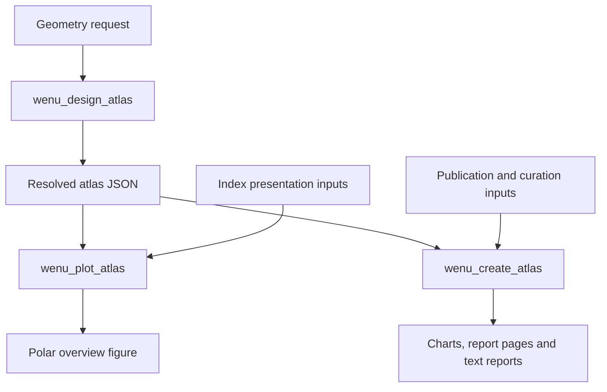

# Creating a sky atlas — planned workflow

**Status (2026-10-09): approved planning direction, not an implemented CLI.**
`wenu_design_atlas`, `wenu_plot_atlas` and `wenu_create_atlas` are planned
commands. Their flags and input schemas are not yet frozen. The diagram and
filenames below describe the intended workflow; they are not runnable examples.
Existing charts continue to use [`wenu_chart`](configuration.md).

## Commands and inputs



| Planned command | Inputs | Outputs |
|---|---|---|
| `wenu_design_atlas` | Paper and useful chart rectangle; approximate angular field; projection; sheet overlap; common meridian RA; shared equatorial band width; placement, orientation and numbering choices | **Only** a versioned, resolved atlas JSON; no figure and no astronomical catalogue selection |
| `wenu_plot_atlas` | Resolved JSON plus independent overview layout, astronomical layers, typography and export choices | The two overlapping polar overview maps as an index figure, in PNG, PDF or SVG |
| `wenu_create_atlas` | Resolved JSON plus chart appearance, catalogue selection, curation, report and export choices | Individual chart pages, facing report pages, and text reports; planned structured report data |

For example, keep the roles in separately versioned files:
`atlas_design_request_v1.toml`, `atlas_design_v1.json`,
`atlas_index_style_v1.toml` and `atlas_publication_v1.toml`.
TOML is a proposed format for user inputs; neither its keys nor CLI argument
syntax is specified here. The JSON is generated by the designer, rather than
manually assembling a list of chart footprints. Increment the filename version
when handing off a changed input or product.

## What the user prepares

1. **Prepare the geometry request.** Choose the physical page, margins (including
   binding), projection and approximate angular field. The starting edition uses
   ISO B4 landscape (353 × 250 mm), with a chart on each right-hand page.
   Choose overlap between neighbouring sheets, the RA of the common meridian
   for the overview pair, and the total angular width of their shared equatorial
   band. Select an initial region (Orion is the proposed starting region),
   orientation and editorial ordering. Compare candidate field sizes, for example
   30°, 40° and 50°, before adopting one; these are trials, not defaults.
2. **Generate and inspect the design.** The designer resolves centres and coverage
   into JSON. Prepare the separate index presentation input and use the plotter
   to examine coverage, sheet numbers and navigation. Iterate on geometry if
   there are gaps, unsuitable fields or inconvenient page joins. Freeze a design
   revision before substantial curation.
3. **Prepare the index presentation input.** Choose the size of the overview
   figure, margins, labels, colours and layers. Optional layers include stars,
   Milky Way, Magellanic Clouds, constellation lines, boundaries and abbreviations.
   Stars of magnitude 4 or brighter are an initial trial, not an adopted limit.
   These choices do not alter sheet coverage or numbers.
4. **Prepare the publication and curation input.** Choose chart layers, selected
   star names and Bayer labels, magnitude limits, appearance and output formats.
   Supply the object selections and notes for reports, indicating interest for
   naked-eye, binocular and amateur-telescope observation; categories may
   overlap. Unreviewed suitability remains pending, rather than being inferred
   from a magnitude threshold.
5. **Produce and review a small sample first.** Create the first chart/report
   pairs, beginning around Orion and a contrasting region, then refine star
   symbols, labels and report layout. After accepting the sample, generate the
   remaining pairs and curate them chart by chart. Keep unplotted objects indexed
   for future zoom subcharts instead of deleting catalogue entries.

## Coverage and the polar index

Each sheet has a centre on the celestial sphere defining its tangent plane,
an orientation, a projection and a useful rectangular viewport. Its spherical
footprint follows from projecting that rectangle; it is not an arbitrary
rectangle of RA and declination. The approximate field size, projection and
page aspect ratio jointly determine its dimensions. Individual sheets overlap
and cover the entire sphere, including two actual polar atlas sheets.

The two **polar overview maps** are separate from those polar atlas sheets.
Their common meridian runs through the centre of the shared area; the opposite
meridian is 12 hours away. The shared band width is a total angular width measured
along that meridian. With a symmetric example width of 20°, the northern overview
extends to declination −10° and the southern overview to +10°. This is an example,
not a default. The shared band, neighbouring-sheet overlap and physical overlap
of the two overview shapes on paper are three different quantities.

The plotter should show the overview maps side by side with their inner contours
clipped/composed across the common area. The roughly one-third shared appearance
is a visual goal to assess in a prototype, not a fixed conversion from angular
width to paper spacing. Index borders show each sheet's primary area without its
overlap; the actual sheet footprint includes that overlap. A sheet appearing in
both overviews has the same number.

Individual sheet projection remains a decision to compare. A tangent plane
alone does not choose between stereographic and gnomonic projection. A finite
gnomonic polar sheet cannot extend to the equator. Stereographic projection is
the intended starting point for the hemispheric overviews; it does not settle
the projection or extent of the individual polar atlas sheets.

## What the resolved JSON records

The versioned JSON must contain the resolved design, not only the generator
recipe: schema version and design revision; coordinate frame and applicable
equinox conventions; paper and useful rectangle; sheet identifiers and editorial
numbers; centres, orientations, projections and projected extents; spherical
footprints, primary areas and neighbours; overview common meridian and shared
band; and generator/input provenance. Stellar source epochs are distinct from
coordinate equinox conventions.

Internal identifiers and editorial numbers have different purposes. The
reproducible numbering rule and identifier behaviour after a redesign still
need a contract; arbitrary retiling must not silently reuse identities.
Coverage validation must detect gaps and measure overlap. Report ownership
should use primary areas, with cross-references for overlap; extended objects
need footprint-aware membership, not just a centre test.

## Changing a finished design

| Change | User action |
|---|---|
| Individual page useful rectangle, angular field, sheet projection, centres or overlap | Revise geometry input and regenerate the JSON; review numbering and coverage |
| Index size, layout, typography, optional astronomical layers or export format | Revise index presentation input and rerun the plotter with the same JSON |
| Selected objects, chart appearance, notes or report categories | Revise publication/curation input and rerun the affected chart/report products |

Each right-hand chart page is paired with a left-hand landscape page containing
the legend, magnitude key, object report and navigation. Chart pages prioritise
astronomical content; selected Bayer labels and optional constellation boundaries
are envisaged. Coordinate furniture remains an editorial decision.

The producer should reuse the existing chart composition and export pipeline,
initially through orchestration of canonical chart requests or `wenu_chart`
calls after an interface audit. There is no separate rendering pipeline planned.

Implementation stages and acceptance gates are recorded in the
[active developer roadmap](../developer/post_v0.9_architecture_roadmap.md#atlas-organisation-checkpoint-2026-10-09).


## Geometry specimen API available for review

The first implementation candidate supplies Python records in
`wenu.atlas_design`, not the three atlas commands. Define a right-hand page
with explicit margins, a common-meridian RA and total shared-band width, and
an explicit list of sheet centres and horizontal field widths. Nonpolar sheets
default to north up and increasing RA to the left; polar sheets require a
meridian orientation. Angular height is derived from the useful paper rectangle
through the projection. This lets us test physical scale without a star catalogue.

`AtlasGeometrySpecimen` can write/read a versioned file such as
`atlas_geometry_specimen_v1.json`. Its document kind explicitly says specimen
and its coverage status is `unverified`; it must not be used as a finished
whole-sky design. The API checks duplicate identities, invalid coordinates,
unknown JSON keys and disagreement between stored and recomputed geometry.
Diagnostic edge samples do not prove full-sky coverage. Primary areas,
neighbours and automatic placement come later. See the
[specimen API reference](../developer/implementation_reference.md#atlas-geometry-specimen-api-candidate).


## Band-coverage comparison API available for review

This next Python prototype can resolve and validate a complete conservative
band layout. The three command-line tools above remain planned. It does not
produce an index picture or report pages.

Prepare the physical page and margins, a horizontal field, a minimum angular
overlap between sheets and a separate placement seed RA. The overview join RA
and shared band remain independent. For example, the following is a Python
API example, not the future CLI or TOML format:

```python
from wenu.atlas_design import (
    AtlasPageGeometry, AtlasOverviewGeometry, design_band_atlas,
)

atlas = design_band_atlas(
    "b4-trial", 1,
    AtlasPageGeometry(353, 250, 10, 10, 20, 10),
    AtlasOverviewGeometry(join_ra_deg=82.5, shared_band_width_deg=20),
    field_width_deg=40, overlap_deg=2, seed_ra_deg=82.5,
)
atlas.write_json("atlas_band_trial_v1.json")
print(atlas.validation())
```

With these page/margin/overlap inputs, 30°, 40° and 50° fields give
**236, 128 and 80 sheets**. These are comparison cases, not accepted defaults.
The conservative placement uses the cap inside the shorter side of each
rectangle and therefore uses more sheets than a layout exploiting its full
width. An equatorial row includes the selected seed centre; the number of
sectors decreases toward the polar sheets. Numbering runs south to north,
with increasing RA from the seed in each row.

The JSON stores the resolved centres and primary ownership regions. Its
reader revalidates the whole-sphere partition and containment without
re-running placement. Primary regions partition the sky; full tangent-plane
rectangles include overlap. Shared-boundary neighbours are reciprocal; the
stored overlap is a conservative lower bound, not an actual intersection area.
The coverage check is analytic with a numerical guard, not a sampled-sky
claim or formal interval proof.

Changing overview join/band geometry preserves sheet centres, coverage and
IDs. Changing the page, field, overlap or placement seed requires a new
design revision and a new identifier namespace. Keep each trial JSON under
its own versioned filename and review coverage and sheet count before curation.
The prototype accepts stereographic fields from 5° to 120°, a remaining
inscribed cap of at least 1°, and at most 4,096 sheets; it fails explicitly
if the request cannot fit these bounds. It does not support arbitrary moved
centres or gnomonic tiling yet.
