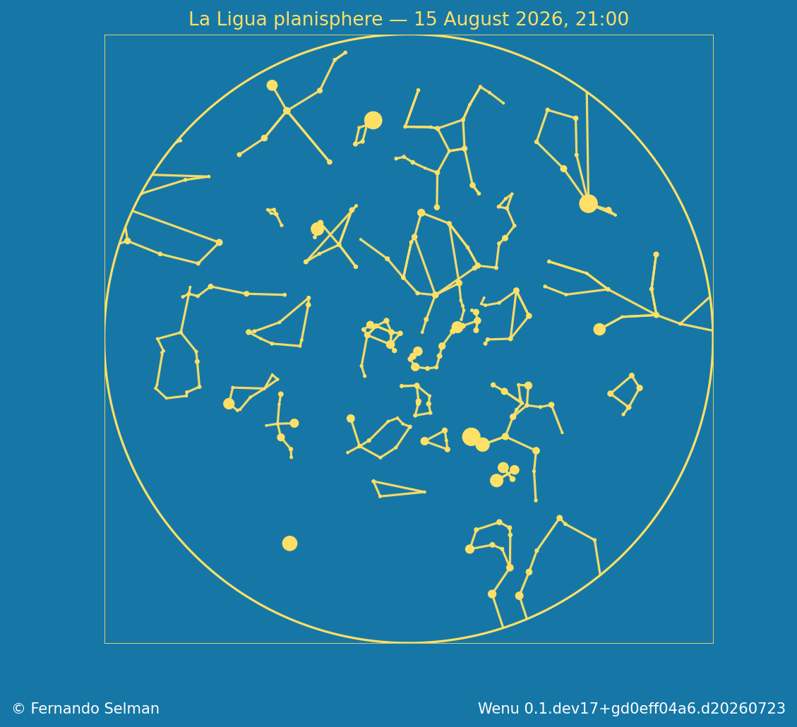

# Planisphere

`examples/planisphere.py` produces the visible sky from La Ligua at 21:00 local
time on 15 August 2026. The observer defines the horizon and the chart remains
zenith-centred. Content switches never remove or alter the circular horizon.
The sky-colored interior is opaque, the canvas outside the horizon is
transparent, and requested legends are placed outside the sky circle.

Generate one detailed print product:

```bash
python examples/planisphere.py \
  --style atlas --mode print \
  --output output/planisphere-atlas-print.png
```

Generate the four style/mode products:

```bash
python examples/planisphere.py \
  --all-products --output output/planisphere
```

References, poles, legends, cumulative star counts, and credits are opt-in:

```bash
python examples/planisphere.py \
  --style atlas --mode presentation \
  --grid-references all --poles --pole-labels \
  --legends --star-counts --credits \
  --output output/planisphere-context.png
```

Use `--magnitude-limit VALUE` to override stellar depth. Constellation labels
and IAU boundaries are independently enabled with `--constellation-labels`
and `--constellation-boundaries`.

This canonical example supplies Spanish title, reference-curve annotations,
object-symbol labels, and stellar-legend title through example-local legend
overrides. Library-wide legend defaults remain English.

## README image provenance

The checked-in image is the accepted cartoon presentation product:



- script: `examples/planisphere.py`;
- generating source commit: `44c16fd` (the canonical planisphere script is
  unchanged through the 44I base commit `5fcde48`);
- destination: `docs/user_guide/assets/la-ligua-planisphere.png`;
- format and dimensions: RGBA PNG, 1129 × 1030 pixels;
- SHA-256: `5f4d7a17f6e7334e39cd3d28a158010ce59c80dbabd58f112a52fe62f1cedbba`;
- visual approval: approved during the canonical cartoon planisphere review;
- regeneration command:

```bash
python examples/planisphere.py \
  --style cartoon --mode presentation \
  --output docs/user_guide/assets/la-ligua-planisphere.png \
  --credits
```

Run the command from the repository root. Regeneration is an intentional
documentation operation; ordinary chart output remains below `output/`.
